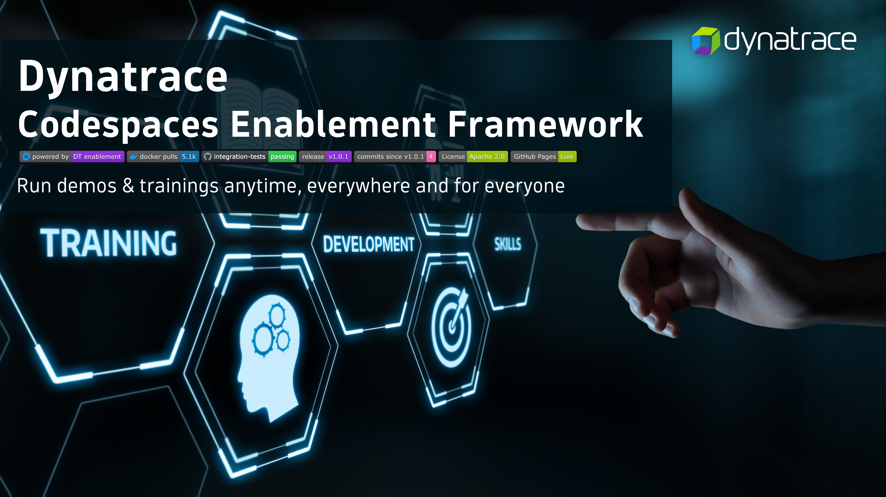

<!-- markdownlint-disable-next-line -->
#  Dynatrace Enablement Framework

___

The Dynatrace Enablement Framework streamlines the delivery of demos and hands-on trainings for the Dynatrace Platform. It provides a unified set of tools, templates, and best practices to ensure trainings are easy to create, run anywhere, and maintain over time.

  

This repository is the source of truth for the framework: the container image, sync CLI, core shell functions, and templates that power every enablement lab.

___

### What's included

- **Container image** — Pre-built dev environment with Kind, kubectl, Helm, and Dynatrace CLI tools (`shinojosa/dt-enablement`)
- **Sync CLI** — Manages versioned updates, migrations, PRs, tagging, and releases across all consumer repos
- **Versioned pull model** — Each repo pins a `FRAMEWORK_VERSION` and pulls core functions from a cached release at startup
- **MkDocs documentation** — Shared base config with RUM tracking, auto-deployed to GitHub Pages
- **Integration tests** — CI pipeline that validates the framework inside a real Codespace environment

### Enablement registry

Browse all available labs, demos, and workshops with live CI status and documentation links:

**[dynatrace-wwse.github.io](https://dynatrace-wwse.github.io)**

### Documentation

**[📖 Full documentation and architecture](https://dynatrace-wwse.github.io/codespaces-framework)**
