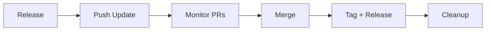

--8<-- "snippets/synchronizer.js"


!!! example "Sync CLI 🔁"
	The **Sync CLI** manages framework versions, migrations, and releases across all repositories in the `dynatrace-wwse` organization. One tool to keep every repo up to date.

## Overview

The Sync CLI runs from the `codespaces-framework` directory and operates on repos listed in `repos.yaml`. It follows a **local-first** workflow: repos are cloned locally, changes are made on branches, then pushed as PRs.

```bash
cd codespaces-framework
PYTHONPATH=. python3 -m sync.cli <command> [options]
```

---

## Full Release Cycle

The workflow for updating all repos to a new framework version:



### Step 1: Release a new framework version

Make your changes to the framework, commit them, then release:

```bash
# Bump patch (1.2.5 → 1.2.6), tag, push, create GitHub Release
sync release --part patch
```

This creates a git tag on `codespaces-framework`, updates the default version in `cli.py`, and creates a GitHub Release with a categorized changelog (features, fixes, docs, maintenance).

To create a release for an existing tag without bumping:

```bash
sync release
```

### Step 2: Push updates to all repos

```bash
# Preview what would change
sync push-update --framework-version 1.2.6 --dry-run

# Execute: pull main → branch → full migrate → commit → push → PR
sync push-update --framework-version 1.2.6
```

Per repo, `push-update`:

1. 📥 Clones if not present locally
2. 🔄 Checks out main and pulls latest
3. 🌿 Creates branch `sync/framework-1.2.6`
4. 🔧 Runs full migration (Category A cleanup, templates, mkdocs, .env, README badges, devcontainer.json fixes)
5. 📝 Commits all changes
6. 🚀 Pushes branch and creates PR

On failure at any step, the branch is left in place for manual intervention.

To re-push changes at the same version (e.g. after fixing badges or templates):

```bash
sync push-update --framework-version 1.2.6 --force
```

### Step 3: Monitor CI and merge

```bash
# List all open PRs with CI status
sync list-pr

# Filter to sync PRs for a specific version
sync list-pr --framework-version 1.2.6

# Merge passing PRs
sync list-pr --merge

# Close old PRs that are superseded
sync list-pr --framework-version 1.2.5 --close -c "Superseded by 1.2.6"
```

### Step 4: Tag consumer repos and create releases

After all PRs are merged:

```bash
# Preview
sync tag --framework-version 1.2.6 --bump patch --release --dry-run

# Create combined version tags + GitHub Releases
sync tag --framework-version 1.2.6 --bump patch --release
```

Each repo gets a tag like `v1.2.6_1.0.1` (framework version + repo version) and a GitHub Release with categorized changelog.

### Step 5: Cleanup

```bash
# Delete merged branches (local + remote)
sync cleanup-branches

# Verify everything is clean
sync validate
```

---

## Migration: What Happens

When `push-update` or `migrate` runs on a repo, it executes these phases:

| Phase | Action |
|-------|--------|
| **1. Audit** | Identifies Category A files and validates `devcontainer.json` |
| **1b. Fix devcontainer.json** | Auto-bumps image `v1.0`/`v1.1` → `v1.2` |
| **2. Clean Category A** | Removes framework-owned files (now pulled from cache) |
| **3. Thin Makefile** | Installs wrapper that delegates to cached `makefile.sh` |
| **4. source_framework.sh** | Installs/updates versioned pull mechanism |
| **5. mkdocs.yaml** | Converts to `INHERIT: mkdocs-base.yaml` pattern |
| **6. overrides/main.html** | Parameterizes RUM snippet, extracts URL to mkdocs.yaml |
| **7. deploy-ghpages.yaml** | CI fetches `mkdocs-base.yaml` at framework version |
| **8. .gitignore** | Adds cache, mkdocs-base, Dockerfile.framework entries |
| **9. .env location** | Moves from `runlocal/.env` to `.devcontainer/.env` |
| **10. README badges** | Updates branding, adds missing badges, fixes integration test link |

---

## All Commands

### Migration & Updates

| Command | Description | Example |
|---------|-------------|---------|
| `push-update` | Full workflow: pull → branch → migrate → push → PR | `sync push-update --framework-version 1.2.6` |
| `migrate` | Local migration preview (no git operations) | `sync migrate --dry-run` |
| `revert` | Undo uncommitted changes | `sync revert --repo template` |
| `validate` | Check schema, GitHub, templates, badges | `sync validate` |

### Versioning & Releases

| Command | Description | Example |
|---------|-------------|---------|
| `release` | Tag framework, create GitHub Release | `sync release --part patch` |
| `tag` | Tag consumer repos with combined version | `sync tag --framework-version 1.2.6 --bump patch --release` |

### Repository Management

| Command | Description | Example |
|---------|-------------|---------|
| `clone` | Clone repos from repos.yaml | `sync clone --all` |
| `protect-main` | Apply branch protection rules | `sync protect-main` |
| `cleanup-branches` | Delete merged branches | `sync cleanup-branches --dry-run` |

### Monitoring

| Command | Description | Example |
|---------|-------------|---------|
| `list-pr` | List PRs, approve, merge, or close | `sync list-pr --merge` |
| `list-issues` | List open issues | `sync list-issues --label bug` |
| `status` | Show version drift | `sync status` |
| `list` | List registered repos | `sync list --sync-managed --json` |

---

## Common Recipes

### First-time setup

```bash
sync clone                    # Clone all repos locally
sync validate                 # Check current state
sync migrate --dry-run        # Preview migration
```

### Deploy a framework update

```bash
sync release --part patch                          # 1.2.5 → 1.2.6
sync push-update --framework-version 1.2.6         # Create PRs
sync list-pr --framework-version 1.2.6             # Monitor CI
sync list-pr --merge                               # Merge passing
sync tag --framework-version 1.2.6 --bump patch --release  # Tag + release
sync cleanup-branches                              # Clean up
```

### Fix something and re-push at the same version

```bash
# Edit the framework, commit
sync push-update --framework-version 1.2.6 --force
```

### Close old PRs

```bash
sync list-pr --framework-version 1.2.5 --close -c "Superseded by 1.2.6"
```

### Housekeeping

```bash
sync protect-main              # Protect main on all repos
sync cleanup-branches          # Delete stale branches
sync list-issues               # Check for open issues
```

---

## Key Files

| File | Purpose |
|------|---------|
| `sync/cli.py` | CLI entry point |
| `sync/core/repos.py` | `repos.yaml` parsing, `RepoEntry` dataclass |
| `sync/core/version.py` | Version parsing and bumping |
| `sync/core/github_api.py` | GitHub API via `gh` CLI |
| `sync/core/local_git.py` | Local git operations |
| `sync/commands/migrate.py` | Migration logic, file classification, templates |
| `sync/commands/push_update.py` | Local-first push-update |
| `sync/commands/release.py` | Framework release with changelog |
| `sync/commands/tag.py` | Consumer repo tagging + releases |
| `sync/commands/list_pr.py` | PR listing, approve, merge, close |
| `repos.yaml` | Registry of all repos |

---

## Command Scope

| Command | Repos it operates on |
|---------|---------------------|
| `push-update`, `migrate`, `revert`, `tag` | sync-managed only (consumer repos) |
| `list-pr`, `list-issues`, `protect-main`, `cleanup-branches` | all active repos (including framework, website, tracker) |
| `clone` | sync-managed by default, `--all` for everything |
| `release` | framework repo only |

---

<div class="grid cards" markdown>
- [Continue to Testing →](testing.md)
</div>
