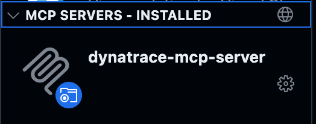
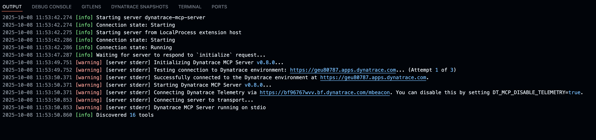
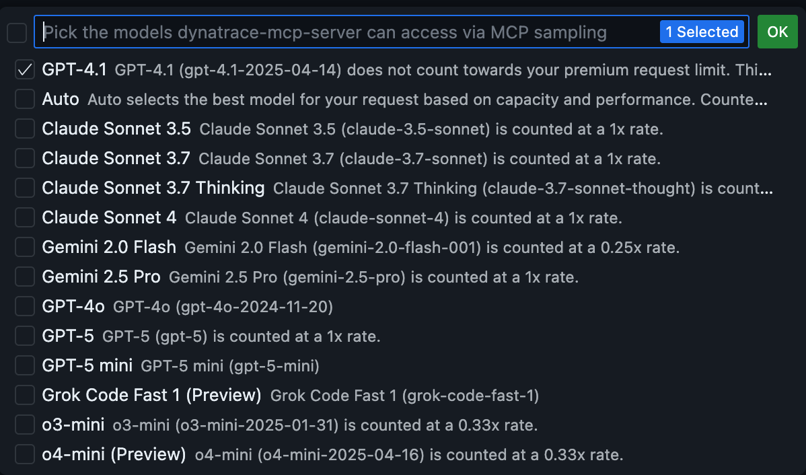

!!! info "Dynatrace MCP integration & Observability"
    This section explains how the [Dynatrace MCP Server](#mcp-server-integration) operates within your environment and how [Dynatrace Observability](#dynatrace-observability) is activated to monitor any application running in the enablement repositories.

---

##  MCP Server Integration
The Dynatrace MCP (Model Context Protocol) Server enables AI Assistants to seamlessly interact with the Dynatrace observability platform, delivering real-time data directly into your enablement workflows—no manual configuration required. It is automatically embedded in all repositories within the Framework for VS Code, ensuring consistent access to monitoring and automation capabilities across development environments.


### Prerequisites
1. The repository is opened in VS Code (Web and Desktop versions).
- You have defined the `DT_ENVIRONMENT` 

!!! info "Single Sign-On (SSO) Support"
    The MCP Server supports **Single Sign-On (SSO)** in Dynatrace, enabling seamless authentication across environments. Any Dynatrace environment the user can connect to is automatically accessible via MCP—no additional authentication required.

??? info "Optional Control Variables"
    | Variable | Default Value | Description |
    |----------|---------------|-------|
    | `DT_PLATFORM_TOKEN` | Optional | Authentication token for Dynatrace MCP Server, supports Single Sign-On. For full list of [supported scopes](https://github.com/dynatrace-oss/dynatrace-mcp?tab=readme-ov-file#scopes-for-authentication) and use cases, refer to Dynatrace MCP documentation |
    | `DT_GRAIL_QUERY_BUDGET_GB` | 1000 GB |  Budget limit for Grail queries in GB. Server tracks bytes scanned across all queries in current session. Warnings at 80% usage, alerts when exceeded. Resets on server restart |
    | `DT_MCP_DISABLE_TELEMETRY`  | `false` | Controls telemetry collection, when `true`, disables telemetry. Only anonymous usage statistics and error information are collected. No sensitive Dynatrace environment data is tracked |


### Environment Configuration

Before you begin working with the MCP-enabled agent, you'll need to tell the agent to which Dynatrace environment it should connect to. The MCP Server supports SSO via VS Code Desktop and Web 🚀.


!!! info "Playground as default environment"
    If no environment is set, `DT_ENVIRONMENT` falls back to a shared playground tenant. The
    environment menu in the framework (`dynatraceEvalReadSaveCredentials` in
    `.devcontainer/util/functions.sh`) offers it as option 1 and holds the current URL — read it
    there rather than from this page, so it cannot go stale.

### Step 1:Connecting the MCP Server 

!!! info "Steps to establish an MCP Server Connection"
    1. On the IDE go to the left pane > `Extensions > MCP Servers Installed  > dynatrace-mcp-server`
    - Open dynatrace-mcp-server click on the configuration wheel > Start server
    - The server should start, it will read the environment file located at `.devcontainer/.env` and will read the variable DT_ENVIRONMENT
    - In the Server output (click on Show Output in the configuration wheel )
    - A link for the SSO authentication should open automatically (if not then click on it).
    - "✅ Successfully retrieved token from SSO!" is what you should see if you have access to the environment. Now let the agents communicate with the environment.
         


!!! question "Steps to connect to another Dynatrace environment"
    1. There is a comfort function that helps you set the DT_ENVIRONMENT variable called `selectEnvironment`.
    - Type `selectEnvironment` in the terminal, select an environment or enter your own environment.
    - Restart the MCP Server by going to `Extensions > MCP Servers Installed  > dynatrace-mcp-server > restart server`


### Step 2: Start Chatting with the Agent

After successfully connecting to the MCP server, you can now interact with the AI agent!

The agent has access to:

- **Code Analysis**: Analyze the application code in this repository
- **Dynatrace Insights**: Query logs, metrics, traces, and events from the monitoring tenant
- **Davis CoPilot**: Get intelligent recommendations and problem analysis
- **Observability Data**: Access real-time monitoring data and application behavior

!!! info "Ask the agent what can you do with the MCP Server"
    A very useful question is to ask the agent what can you do with Dynatrace's MCP Server. The MCP Server is pulling from `latest` meaning every week you'll get more features. In order to check the latest stand, just ask the agent and it'll give you a comprenhensive list of what you can do depending on the tools installed at that time. 


### Comfort Functions for Environment Management

To simplify MCP server configuration, two convenience functions are available:

#### 1. selectEnvironment

``` bash
selectEnvironment
```
Prompts you to select a Dynatrace environment and configures it system-wide:

- **Available environments**: Playground, demo.live, or tacocorp
- **Actions**: Exports the environment variable and writes it to the `.env` file
- **Usage**: Use this when you want to change the default environment for all operations


### Starting the MCP Server  {align="right", width="200";}

On VS Code, on the left pane, click on the Extensions tab `Shift + ⌘ + X`. You should be able at the bottom to see a `dynatrace-mcp-server` installed under MCP servers.
    
1. Click on the wheel icon (settings) and click on Start Server
- The output should show automatically (if not then click on `show output`). You should be able to see a similar output:
    { width="800";}


!!! example ""
    Yay! the AI Agent (by default in VS Code is GPT) should be able now to fetch information from the Dynatrace environment.


!!! tipp ""
    Verify that the connection is active. Ask the agent, "what can I do with my dynatrace mcp server? give me a comprenhensive list"


### Example Prompts 

!!! example "Example Prompts 💬"
    
    | Use Case    | Prompt |
    | -------- | ------- |
    | Find a monitored entity  | `Get all details of the entity 'my-service'`    |
    | Find error logs |  `Show me error logs`     |
    | Write a DQL query from natural language    | `Show me error rates for the payment service in the last hour`    |
    | Explain a DQL query |  What does this DQL do? <br> `fetch logs | filter dt.source_entity == 'SERVICE-123' | summarize count(), by:{severity} | sort count() desc` |
    | Chat with Davis CoPilot | `How can I investigate slow database queries in Dynatrace?` |
    | Send email notifications |`Send an email notification about the incident to the responsible team at team@example.com with CC to manager@example.com`|
    |Multi-phase incident response | Our checkout service is experiencing high error rates. Start a systematic 4-phase incident investigation <br>1. Detect and triage the active problems <br>2. Assess user impact and affected services. <br>3. Perform cross-data source analysis (problems → spans → logs) <br>4. Identify root cause with file/line-level precision |

    For more prompts [read the full documentation](https://github.com/dynatrace-oss/dynatrace-mcp?tab=readme-ov-file#-example-prompts-)

### Configure Model Access
If you want to give access to other AI Agents and premium models, click in the Settings of the Dynatrace MCP Server, and select `Configure Model Access`, then select the models you want to give access to. 


{ align="center"; width="600";}


---


##  Dynatrace Observability
All repositories using the Enablement Framework can automatically activate Dynatrace Full-Stack Observability or Application Monitoring, enabling seamless monitoring of the Kubernetes cluster and all deployed applications—no manual setup required.

### Prerequisites
The container needs three environment variables to monitor its Kubernetes cluster: `DT_ENVIRONMENT`, `DT_OPERATOR_TOKEN` and `DT_INGEST_TOKEN`. Where they come from depends on where the container runs:

| Where it runs | Who provides the variables |
|---|---|
| **Dynatrace Enablement app (Orbital)** | Nobody by hand. The app **mints** the tokens in the learner's tenant from the repo's [`dt-tokens.yaml`](#tokens-dt-tokensyaml) and Orbital writes them into `.devcontainer/.env` before `post-create.sh` runs. |
| **GitHub Codespaces** | Codespaces secrets (`devcontainer.json` → `secrets`). |
| **VS Code Dev Containers / local `make`** | A `.devcontainer/.env` file (gitignored). See [Instantiation types](instantiation-types.md#secrets-environment). |

### Monitoring a Kubernetes Cluster automatically

Let's say we want to create an enablement where we deploy a Kubernetes Cluster and we want to deploy and monitor Astroshop also automatically when the enablement starts. Our post-create.sh file can look like this:

```bash title=".devcontainer/post-create.sh" linenums="1"
#!/bin/bash
#loading functions to script
export SECONDS=0
source .devcontainer/util/source_framework.sh

setUpTerminal

startK3dCluster

installK9s

# Dynatrace Operator is deployed automatically
dynatraceDeployOperator

# Deploys the DynaKube in the mode set by dynakube-defaults.yaml / dynakube-config.yaml
# (AppOnly by default). deployApplicationMonitoring and deployCloudNative force a mode.
deployDynatrace

# The Astroshop will be deployed as a sample
deployApp astroshop

# This step is needed, do not remove it
# it'll verify if there are error in the logs and will show them in the greeting as well a monitoring
finalizePostCreation

printInfoSection "Your dev container finished creating"
```


Now let's break it down.

- Line 1 - 6: This code is needed for loading the framework and setting up the terminal for the container.
- Line 8 and 10: `startK3dCluster` and `installK9s` create the Kubernetes Cluster (K3d, the default engine) and install k9s for easy management of your Kubernetes Cluster. For learning more go to [Kubernetes Cluster](framework.md#kubernetes-cluster) section of the Framework section.
- Line 13: `dynatraceDeployOperator` checks for the needed credentials and deploys the Dynatrace Operator with its components (CSI Driver and Webhook).
- Line 17: `deployDynatrace` generates the DynaKube from the [DynaKube configuration](#dynakube-configuration-defaults-and-repo-override) and applies it. With no argument it uses the configured `mode:` — **AppOnly** by default.
- Line 20: `deployApp astroshop` will call the deployApp repository and deploy Astroshop.

| Function | Mode |
|---|---|
| `deployDynatrace` | the `mode:` from the DynaKube config (`apponly` unless the repo overrides it) |
| `deployDynatrace <mode>` | `apponly`, `cloudnative` or `k8s-only`, explicitly |
| `deployApplicationMonitoring` | always `apponly` |
| `deployCloudNative` | always `cloudnative` — the OneAgent DaemonSet cannot start on K3d nodes or under Orbital's Sysbox, so use it only on Kind outside Orbital |

!!! info "Race conditions safeguard"
    The framework includes logic to manage resources efficiently and prevent race conditions. For example, `deployDynatrace` will not apply the DynaKube while the Dynatrace Operator webhook is still starting. Once the Operator is ready, the DynaKube is applied and the ActiveGate is awaited, followed by the application itself. This ensures that Dynatrace components are fully operational before any application deployment begins.

### Tokens: `dt-tokens.yaml`

When a training runs in the **Dynatrace Enablement app**, nobody pastes a token. The app mints scoped, short-lived tokens in the learner's own tenant, and Orbital writes them into the container's `.devcontainer/.env` **before** `post-create.sh` runs. Which tokens, with which scopes, under which variable names, is declared in one file:

- Framework default: [`.devcontainer/yaml/dt-tokens.yaml`](https://github.com/dynatrace-wwse/codespaces-framework/blob/main/.devcontainer/yaml/dt-tokens.yaml) — an operator token (`DT_OPERATOR_TOKEN`) and an ingest token (`DT_INGEST_TOKEN`).
- Repo override: the training repo's own `.devcontainer/yaml/dt-tokens.yaml`. Real example: [enablement-kubernetes-101](https://github.com/dynatrace-wwse/enablement-kubernetes-101/blob/main/.devcontainer/yaml/dt-tokens.yaml).

```yaml title=".devcontainer/yaml/dt-tokens.yaml (repo override)"
migrationStatus: migrated        # migrated | pending (default) | legacy-classic-only

tokens:
  - name_suffix: operator        # token name: enbl-<training>-<user>-operator
    env_var: DT_OPERATOR_TOKEN   # the variable the container receives
    scopes:                      # classic scopes (dotted names)
      - activeGateTokenManagement.create
      - activeGateTokenManagement.write
      - entities.read
      - settings.read
      - settings.write
      - DataExport
      - InstallerDownload
    platform_scopes:             # used where the tenant mints platform (dt0s16) tokens
      - fleet-management:activegate.connection-info:read
      - fleet-management:activegate.tokens:create
      - fleet-management:container-images:read
      - fleet-management:oneagent.connection-info:read
      - fleet-management:oneagents:download
      - settings:objects:read
      - settings:objects:write

  - name_suffix: ingest
    env_var: DT_INGEST_TOKEN
    scopes: [metrics.ingest, logs.ingest, events.ingest, openTelemetryTrace.ingest]
    platform_scopes:
      - openpipeline:logs:ingest
      - openpipeline:metrics:ingest
      - openpipeline:traces:ingest
      - storage:metrics:write

  - name_suffix: api             # an extra token your own functions read
    env_var: DT_API_TOKEN
    aliases: [DT_BIZEVENTS_TOKEN]  # same value under a second variable name
    scopes: [entities.read]
```

| Field | Meaning |
|---|---|
| `name_suffix` | Required. Last part of the token name, `enbl-<training>-<user>-<suffix>` (max 100 chars). |
| `env_var` | Required. The variable name written into `.devcontainer/.env`. Your functions read it like any other variable. |
| `scopes` | Classic scopes (`metrics.ingest`, …). Under `kind: platform` write platform scopes here instead. |
| `kind` | `classic` (default) or `platform` (always minted as a `dt0s16` platform token). |
| `platform_scopes` | Platform scopes (`storage:logs:read`, `openpipeline:logs:ingest`, …) used when the token is minted as a platform token. If absent, `scopes` is translated. |
| `aliases` | Extra variable names that receive the same value. |
| `migrationStatus` | Top level. `legacy-classic-only` means the training needs a classic-only capability; it is the only value that refuses a workshop at creation. |

!!! warning "The repo file REPLACES the default — it is not merged"
    Declaring one extra token means copying the operator and ingest tokens too, or the container starts without them. A repo file with an empty or missing `tokens:` list does **not** fall back to the framework file: it falls back to built-in defaults. Declare only the tokens the training needs — the app mints exactly those.

Tokens expire after 4 hours (the session TTL). Outside the app (Codespaces, local) nothing is minted: provide the same variables as secrets or in `.devcontainer/.env`.

### DynaKube configuration: defaults and repo override

The DynaKube is not a committed manifest. `generateDynakube` builds it at run time into `.devcontainer/yaml/gen/dynakube.yaml` (gitignored) from two flat YAML files:

1. [`.devcontainer/yaml/dynakube-defaults.yaml`](https://github.com/dynatrace-wwse/codespaces-framework/blob/main/.devcontainer/yaml/dynakube-defaults.yaml) — framework-owned, synced to every repo. Do not edit it in a training repo.
2. `.devcontainer/yaml/dynakube-config.yaml` — **your** override, never synced. Only the keys you write change; everything else keeps the default.

```yaml title=".devcontainer/yaml/dynakube-config.yaml"
# flat key: value only — nested YAML is ignored
mode: cloudnative        # apponly (default) | cloudnative | k8s-only
kspm: true
extensions: true
ag_memory_limit: "2Gi"
```

The keys and their defaults are listed in the [Functions reference](functions.md#dynakube-configuration). The DynaKube name and `hostGroup` are `<repo without "enablement-">-<session id>`, cut to fit the operator's name limit; the session id is `DT_HOSTGROUP` (set by Orbital per learner) and always survives whole, which is what lets a DQL filter `endsWith(k8s.cluster.name, "<session id>")` isolate one learner.

### Undeploying Dynakube

Now, let's say you want to undeploy the Dynakubes, there is a comfort function for you to do so, just type `undeployDynakubes` and this will undeploy the Dynakubes. For changing the monitoring mode to `ApplicationMonitoring` just type `deployApplicationMonitoring` and this will deploy the Application Monitoring mode in the cluster.


<div class="grid cards" markdown>
- [Let's continue:octicons-arrow-right-24:](template.md)
</div>