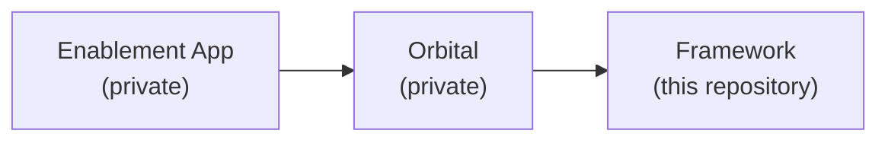

# The wider ecosystem

The Enablement Framework is one of **three** systems that together deliver Dynatrace WWSE
enablement. This page is the map, and only the map: what each system is, which way the
dependencies run, and which site answers which kind of question. Each system documents
itself in full elsewhere.

## The three systems

**The Framework** — this repository. The shared substrate every training repository builds
on: one dev container image that runs on AMD64 and ARM64, the `post-create.sh` and
`post-start.sh` scripts that bring a lab up, the `mkdocs-base.yaml` theme every enablement
site inherits, and `repos.yaml`, the register of training repositories. A training
repository carries the *content*; the framework supplies everything that makes it run, look
and test the same way everywhere.

**Orbital** — the ops platform, in a separate **private** repository
(`dynatrace-wwse/orbital`, [split out of this one](ops-platform.md) on 2026-08-27). It runs
training environments at fleet scale: provisioning one per learner, handing over a shell,
and reclaiming it afterwards. It also dispatches the [nightly integration
runs](testing.md#scheduling-and-nightly-runs) over the repositories in `repos.yaml`. It
carries no training content of its own.

**The Enablement App** — a Dynatrace App, in a separate **private** repository
(`dynatrace-app-enablements`). It is the surface learners and trainers actually look at —
catalog, lab player and progress — [inside their own Dynatrace tenant](enablement-app.md).
It owns no infrastructure: when it needs a live environment, it asks Orbital for one.

## Which way the dependencies run

An arrow points **from** a system **to** the system it depends on.

| System | Depends on | Depended on by |
|---|---|---|
| Framework | — | Orbital, and every training repository |
| Orbital | Framework | Enablement App |
| Enablement App | Orbital | — |

None of those is reciprocal, and the asymmetry is the point:

!!! info "The Framework does not know Orbital exists"
    A public repository that had to know about a private control plane would leak it by
    construction. A training repository built on this framework runs standalone in a
    Codespace or a dev container with no Orbital anywhere in the picture — see
    [Instantiation types](instantiation-types.md). Orbital is one *consumer* of the
    framework, not a requirement of it.

## The seams

| From | To | What crosses |
|---|---|---|
| Enablement App | Orbital | One HTTPS call per action, from a server-side app function |
| Orbital | Framework | `repos.yaml` and the lab scripts, read from a checkout, **read-only** |
| Enablement App | A Dynatrace tenant | Learner-progress business events, for cross-tenant analytics |

Only the middle one involves this repository, and it is one-directional and read-only:
Orbital reads what is published here and writes nothing back. The mechanics of the other
two belong to the systems that own them.

## Where each kind of question is answered

| If you want to know | Read | On |
|---|---|---|
| How a lab environment is built, what the dev container ships, how to author a training | [The Framework](framework.md), [Instantiation types](instantiation-types.md), [Testing](testing.md) | **this site** — public |
| How environments are provisioned, scheduled and reclaimed at fleet scale | Orbital's own documentation | <https://dynatrace-wwse.github.io/orbital/> — **private** |
| How the in-product learner and trainer experience is built | The Enablement App's own documentation | <https://dynatrace-wwse.github.io/dynatrace-app-enablements/> — **private** |

!!! warning "Both of those sites are private — expect a sign-in prompt, not a page"
    Orbital and the Enablement App are private repositories, and their documentation sites
    are served only to members of the **Dynatrace WWSE** GitHub organisation.

    Following either link without that access does **not** show you the documentation and
    does **not** return a plain "not found" — the request is redirected to a GitHub sign-in
    page. If your account is not a member of the organisation, signing in will not reveal
    the content. The links are listed here so the map is complete and so org members can
    reach the right site directly; they are not an invitation that everyone can accept.

    Nothing on those two sites is required to use this framework. Everything needed to
    build, run and publish a training repository is on **this** site.

- [← Repositories](enablements.md)
- [Orbital — Ops Platform →](ops-platform.md)

