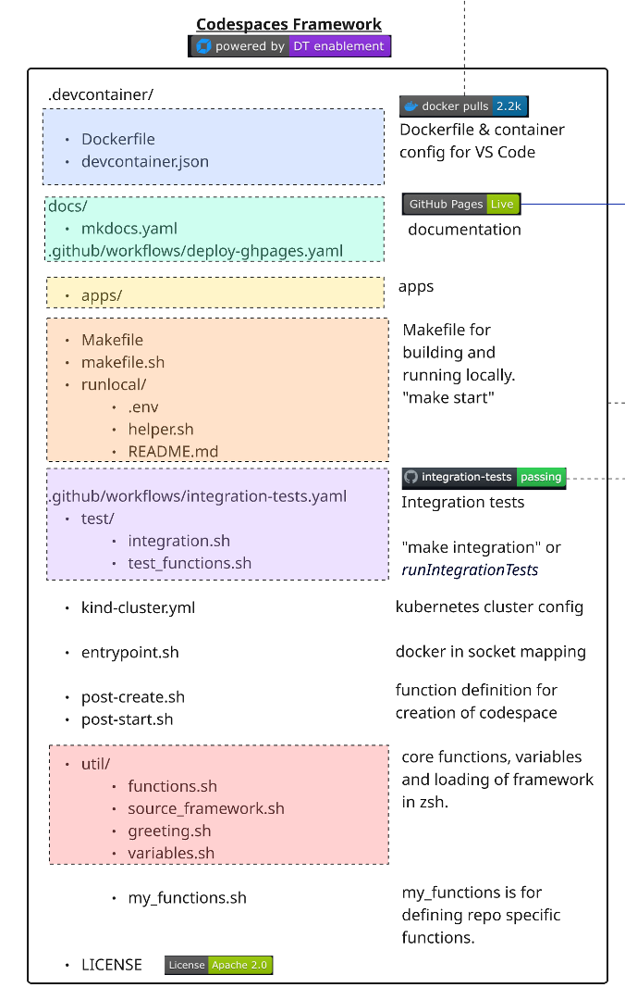
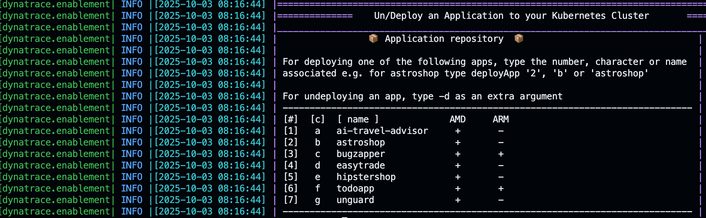

{ align=right ; width="400";}
This section outlines the structure and purpose of each component in the Codespaces Enablement Framework, as visualized in the architecture diagram.


---

## 🏗️ Versioned Pull Model

The framework uses a **versioned cache model** where consumer repos pull framework files at runtime instead of storing them locally. Each repo pins a `FRAMEWORK_VERSION` and only keeps custom files.

### How the Cache Works

When a container starts, `source_framework.sh` resolves framework files through a three-tier cache:

1. **Container cache** (`$HOME/.cache/dt-framework/<version>/`) — fastest, lost on rebuild
2. **Host cache** (`.devcontainer/.cache/dt-framework/<version>/`) — persists across rebuilds
3. **Git clone** — fallback, clones from `codespaces-framework` at the pinned tag via sparse-checkout

```
source_framework.sh
  ├── DEV MODE (functions.sh exists locally) → source directly
  └── CACHE MODE (consumer repos)
       ├── Tier 1: Container cache hit → source from cache
       ├── Tier 2: Host cache hit → copy to container, source
       └── Tier 3: git clone --sparse → populate both caches, source
```

### File Classification

Files in `.devcontainer/` are classified into categories that determine how the framework manages them:

#### Category A — Framework-owned (removed from repos, pulled from cache)

| File | Purpose |
|------|---------|
| `util/functions.sh` | Core framework functions (1800+ lines) |
| `util/variables.sh` | Global variables, colors, port ranges |
| `util/greeting.sh` | Terminal welcome message |
| `util/test_functions.sh` | Test assertion functions |
| `makefile.sh` | Docker build/run logic for local development |
| `runlocal/helper.sh` | ENV file loader, repo name resolver |
| `Dockerfile` | Base image build (consumers pull pre-built image) |
| `entrypoint.sh` | Docker socket GID mapping |
| `kind-cluster.yml` | Legacy location (moved to `yaml/kind/`) |
| `apps/` | Demo applications (astroshop, todo-app, etc.) |
| `p10k/` | PowerLevel10k zsh theme config |
| `yaml/` | Dynakube manifests, Kind cluster config |

#### Category B — Thin wrappers (replaced during migration)

| File | Purpose |
|------|---------|
| `Makefile` | Bootstraps cache, delegates to cached `makefile.sh` |

#### Custom files — Repo-specific (never removed)

| File | Purpose |
|------|---------|
| `devcontainer.json` | Container config (image, runArgs, secrets) |
| `post-create.sh` | Repo-specific setup automation |
| `post-start.sh` | Repo-specific post-start actions |
| `util/source_framework.sh` | Version pin + cache logic |
| `util/my_functions.sh` | Repo-specific custom functions |
| `test/integration.sh` | Repo-specific integration tests |
| `.env` | Secrets for local runs and MCP (gitignored) |
| `manifests/` | Repo-specific K8s manifests |

### Image Tiers

Defined per repo in `repos.yaml` via the `image_tier` field:

| Tier | Description | Default |
|------|-------------|---------|
| `minimal` | Core framework only | — |
| `k8s` | Core + Kind cluster, entrypoint, Dynakube yaml | ✅ |
| `ai` | Same as k8s (extensible for future AI-specific files) | — |

### After Migration — Clean Repo Structure

```
.devcontainer/
  devcontainer.json      # Container config
  .env                   # Secrets (gitignored)
  post-create.sh         # Repo-specific setup
  post-start.sh          # Repo-specific post-start
  Makefile               # Thin wrapper → delegates to cache
  .cache/                # Framework cache (gitignored)
  util/
    source_framework.sh  # Version pin + cache mechanism
    my_functions.sh      # Custom functions
  test/
    integration.sh       # Repo-specific integration tests
  manifests/             # Repo-specific K8s manifests (if any)
```

Everything else comes from the framework cache at the pinned `FRAMEWORK_VERSION`.

---


## 🟦 Container Configuration

Defines the development container for VS Code and Codespaces.

- **devcontainer.json**: Main configuration file. Defines the pre-built image (`shinojosa/dt-enablement`), runtime arguments, volume mounts, lifecycle hooks, and secrets. Extensions are kept empty to ensure portability across platforms (ARM and AMD).
- **`.env`**: Secrets and environment variables for local runs and MCP server. Located at `.devcontainer/.env` (gitignored). Used by all instantiation types: Codespaces reads from GitHub secrets, VS Code/Docker reads from this file.

---


## 🟩 Documentation Workflow (`docs/`)

- **docs/**: Contains all documentation and site configuration.
- **mkdocs.yaml**: Per-repo config using `INHERIT: mkdocs-base.yaml` to inherit the framework's base theme, extensions, and plugins. Only repo-specific fields (site_name, nav, RUM snippet) are defined here.
- **mkdocs-base.yaml**: Framework-owned base configuration (Material theme, deep-purple palette, markdown extensions). Fetched at runtime by CI workflows at the repo's `FRAMEWORK_VERSION` tag.
- **.github/workflows/deploy-ghpages.yaml**: GitHub Actions workflow to deploy documentation to GitHub Pages when a PR is merged into main.

### Live Documentation

- **installMkdocs**: Installs all requirements for MkDocs (including Python dependencies from `docs/requirements/requirements-mkdocs.txt`) and exposes the documentation locally.
- **exposeMkdocs**: Launches the MkDocs development server on port 8000 inside your dev container.

### Deploying to GitHub Pages

- **deployGhdocs**: Builds and deploys the documentation to GitHub Pages using `mkdocs gh-deploy`.

---


## 🟨 App Repository (`apps/`)

This directory contains the application code and sample apps. Each app has its own subfolder inside `apps/` in the framework cache.

### Nginx Ingress + App Exposure

Apps are published through **nginx ingress-nginx** on port 80. Each `registerApp` call creates an Ingress with **three rules** so the app is reachable in every instantiation type without any extra configuration:

| Rule | Matches | Example URL | Environment |
|------|---------|-------------|-------------|
| `<app>.<public-ip>.sslip.io` | sslip.io magic-DNS host | `http://todoapp.18.134.158.252.sslip.io` | VS Code / local container / remote VM |
| `<app>.<hostname>` | machine hostname | `http://todoapp.codespace-abc123` | VS Code / Host-header curl in CI |
| *(catch-all, no host)* | any other Host header | `https://{name}-80.app.github.dev` | **GitHub Codespaces** |

[sslip.io](https://sslip.io) is a wildcard DNS service that resolves `<anything>.<ip>.sslip.io` directly to `<ip>`. No DNS record management needed.

#### How each environment reaches the app

=== "VS Code / Local container"

    Port 80 on the host maps directly to the nginx ingress LoadBalancer. The app is reachable via its sslip.io URL:

    ```
    Browser → http://todoapp.18.134.158.252.sslip.io
                  DNS: sslip.io resolves to 18.134.158.252
                  nginx ingress matches Host header → todoapp service:80
    ```

    `devcontainer.json` forwards port 80: `"forwardPorts": [80]`

=== "GitHub Codespaces"

    Codespaces forwards port 80 from the container and exposes it at `{codespacename}-80.app.github.dev`. Incoming requests carry a Host header that nginx doesn't recognise (it contains the Codespace name, not the sslip.io pattern). The **catch-all ingress rule** (no `host:` field) handles these:

    ```
    Browser → https://{codespacename}-80.app.github.dev
                  Codespaces tunnel → container port 80
                  nginx: no host rule matches → catch-all → primary app service:80
    ```

    `getAppURL` returns `https://${CODESPACE_NAME}-80.app.github.dev` automatically.

    !!! info "Multiple apps in one Codespace"
        When multiple apps are registered the **last** one registered owns the catch-all. Secondary apps are still reachable via their sslip.io host (`app.127.0.0.1.sslip.io`) — `detectIP()` returns `127.0.0.1` in Codespaces which resolves back to the container.

=== "Orbital (CI/CD ops server)"

    On the ops server, ports 80/443 are owned by the server's own nginx. Each CI job gets a K3d cluster on a non-default port (`K3D_LB_HTTP_PORT=30080`). The `assertRunningApp` test function probes via **Host-header curl** — no browser needed:

    ```bash
    # assertRunningApp sends:
    curl --fail --max-time 5 \
      -H "Host: todoapp.172.16.0.10.sslip.io" \
      http://localhost:30080
    ```

    The Host header matches the sslip.io ingress rule; nginx routes correctly even on the non-default port.

#### IP detection (`detectIP`)

| Condition | IP used | Result |
|-----------|---------|--------|
| `$EXTERNAL_IP` set | that value | explicit override |
| GitHub Codespaces | `127.0.0.1` | sslip.io host resolves to loopback; catch-all handles Codespaces URL |
| Otherwise | public IP via `ifconfig.me`, fallback `hostname -I` | standard sslip.io URL |

Apps are registered with `registerApp <name> <namespace> <service> <port>` which creates the Ingress resource and writes to the **app registry** (`~/.cache/dt-framework/app-registry`). The registry persists across shell sessions so `deployApp` can show status even after a restart.

### Managing Apps with `deployApp`

The `deployApp` function deploys and undeploys applications to your Kubernetes cluster:

{ align=center ; } 

#### To deploy an app
```sh
deployApp 2          # by number
deployApp b          # by character
deployApp astroshop  # by name
```

#### To undeploy an app
```sh
deployApp 2 -d
deployApp astroshop -d
```

---


## 🟧 Running Locally

To quickly start a local development container:

```sh
cd .devcontainer
make start
```

The thin **Makefile** bootstraps the framework cache (if missing) and delegates to the cached `makefile.sh`. Available targets:

| Target | Description |
|--------|-------------|
| `make start` | Build if needed, run or attach to container |
| `make build` | Build Docker image |
| `make build-nocache` | Full rebuild without cache |
| `make buildx` | Multi-arch build (amd64/arm64) with push |
| `make integration` | Run integration tests in container |
| `make clean-cache` | Clear the framework cache |
| `make clean-start` | Kill containers, clear cache, fresh start |

The Makefile generates a `cached_makefile.sh` wrapper during bootstrap that correctly sets `ENV_FILE`, `RepositoryName`, and `VOLUMEMOUNTS` to point to the repo (not the cache), ensuring backward compatibility with any cached framework version.

---


## 🟪 GitHub Actions & Integration Tests

Automation for CI/CD and integration testing:

- **.github/workflows/integration-tests.yaml**: Runs integration tests on every PR. The `main` branch is protected — tests must pass before merging.
- **test/integration.sh**: Repo-specific test runner. Loads the framework, then runs assertions.

### Integration Test Function

- **runIntegrationTests**: Triggers integration tests by running the repo's `test/integration.sh` script.

```bash title="integration.sh" linenums="1"
#!/bin/bash
# Load framework
source .devcontainer/util/source_framework.sh

printInfoSection "Running integration Tests for $RepositoryName"

assertRunningPod dynatrace operator
assertRunningPod dynatrace activegate
assertRunningPod dynatrace oneagent

# App is reachable via nginx ingress + sslip.io magic DNS
assertRunningApp todoapp
```

These assertions check that required pods are running and the application is accessible. If any assertion fails, the PR is blocked from merging.

---


## 🟫 Kubernetes Cluster

The framework supports two Kubernetes engines, selected by the `CLUSTER_ENGINE` variable. **K3d is the default** for all new labs.

| Engine | Variable | Strengths | When to use |
|--------|----------|-----------|-------------|
| **K3d** (default) | `CLUSTER_ENGINE=k3d` | Fast startup, built-in LB, native ingress on ports 80/443, multi-worker | All new labs, CI/CD |
| **Kind** | `CLUSTER_ENGINE=kind` | Real Linux kernel features in nodes | CloudNativeFullStack OneAgent (requires kernel namespaces) |

### K3d Cluster (Default)

[K3d](https://k3d.io) runs [K3s](https://k3s.io/) (lightweight Kubernetes) inside Docker. It ships with a built-in LoadBalancer that maps host ports `80` and `443` directly to the nginx ingress controller — no NodePort tricks needed.

```bash
# K3d cluster created with:
k3d cluster create enablement \
  -p "80:80@loadbalancer" \
  -p "443:443@loadbalancer" \
  --k3s-arg "--disable=traefik@server:0"   # traefik replaced by nginx ingress
```

Configurable env vars (override before calling `startK3dCluster`):

| Variable | Default | Purpose |
|----------|---------|---------|
| `K3D_CLUSTER_NAME` | `enablement` | Cluster name |
| `K3D_LB_HTTP_PORT` | `80` | Host port → ingress HTTP |
| `K3D_LB_HTTPS_PORT` | `443` | Host port → ingress HTTPS |
| `K3D_API_PORT` | `6443` | Host port → k8s API server |

!!! tip "Orbital (ops server) overrides"
    On the CI/CD ops server, the host's own nginx already owns ports 80/443. Each CI job overrides to non-conflicting ports:
    ```bash
    K3D_LB_HTTP_PORT=30080  K3D_LB_HTTPS_PORT=30443  K3D_API_PORT=6444
    ```
    `assertRunningApp` reads `K3D_LB_HTTP_PORT` for its Host-header curl probe, so tests work correctly without any code changes.

#### K3d Cluster Functions

| Function | Description |
|----------|-------------|
| `startK3dCluster` | Start, attach to, or create the K3d cluster |
| `createK3dCluster` | Create cluster from env config, install nginx ingress |
| `attachK3dCluster` | Merge kubeconfig and switch context to `k3d-enablement` |
| `stopK3dCluster` | Stop the K3d cluster |
| `deleteK3dCluster` | Delete the cluster and all resources |

Aliases: `startK3sCluster`, `createK3sCluster`, `attachK3sCluster`, etc. map to the same functions for backward compatibility.

### Kind Cluster (Alternative)

[Kind](https://kind.sigs.k8s.io/) (Kubernetes IN Docker) creates Kubernetes nodes as Docker containers. Kind nodes have full Linux kernel access inside Sysbox containers, which enables OneAgent CloudNativeFullStack mode.

```bash
CLUSTER_ENGINE=kind startCluster
```

The Kind cluster config is at `yaml/kind/kind-cluster.yml`.

#### Kind Cluster Functions

| Function | Description |
|----------|-------------|
| `startKindCluster` | Start, attach, or create the Kind cluster |
| `createKindCluster` | Create cluster from `yaml/kind/kind-cluster.yml` |
| `attachKindCluster` | Configure kubeconfig for `kind-kind` context |
| `stopKindCluster` | Stop the Kind container |
| `deleteKindCluster` | Delete the cluster |

### Unified Cluster API

Use these regardless of engine — they route based on `CLUSTER_ENGINE`:

| Function | Description |
|----------|-------------|
| `startCluster` | Start the cluster (K3d or Kind based on `CLUSTER_ENGINE`) |
| `stopCluster` | Stop the cluster |
| `deleteCluster` | Delete the cluster |

The `kubectl` client, `helm`, and `k9s` are automatically configured after `startCluster`.


---


## 🐳 Docker Socket Mapping (`entrypoint.sh`)

The container accesses the host's Docker daemon via the mounted Docker socket (`/var/run/docker.sock`). The `entrypoint.sh` script (baked into the Docker image) handles:

- Host-to-container Docker GID mapping
- Hostname resolution in `/etc/hosts`
- User permission setup

This enables Kind and other Docker-based tools to work inside the dev environment.


---


## 🟦 Container Post-Creation & Start

!!! tip "Repository-Specific Logic"
	Use these files to define logic for automating the creation and setup of your enablement.

- **post-create.sh**: Runs after the container is created. Loads the framework, then executes setup steps:

	```bash title=".devcontainer/post-create.sh" linenums="1"
	#!/bin/bash
	export SECONDS=0
	source .devcontainer/util/source_framework.sh

	setUpTerminal
	startK3dCluster
	installK9s
	dynatraceDeployOperator
	deployAppOnly
	deployTodoApp
	finalizePostCreation

	printInfoSection "Your dev container finished creating"
	```

- **post-start.sh**: Runs every time the container starts (e.g., refresh tokens, expose services).


---


## 🟥 Core Functions (`util/`)

Reusable shell functions loaded into every shell session:

- **functions.sh**: Main library (1800+ lines). Includes logging, Kubernetes helpers, deployment functions, environment management, and tracking.
- **source_framework.sh**: Version-aware loader. Handles DEV MODE (local files) and CACHE MODE (two-tier cache with git clone fallback).
- **greeting.sh**: Welcome message with environment info. Call `printGreeting` or open a new terminal.
- **variables.sh**: Central variables (image versions, port ranges, ENV_FILE path).

### Key variables (`variables.sh`)

| Variable | Default | Description |
|----------|---------|-------------|
| `FRAMEWORK_VERSION` | pinned per repo | Framework tag to pull from cache |
| `MAGIC_DOMAIN` | `sslip.io` | Wildcard DNS for app ingress hosts |
| `K3D_CLUSTER_NAME` | `enablement` | K3d cluster name |
| `K3D_LB_HTTP_PORT` | `80` | K3d LB → ingress HTTP (Orbital overrides to `30080`) |
| `K3D_LB_HTTPS_PORT` | `443` | K3d LB → ingress HTTPS (Orbital overrides to `30443`) |
| `APP_REGISTRY` | `~/.cache/dt-framework/app-registry` | Persisted ingress registrations |
| `CLUSTER_ENGINE` | `k3d` | Cluster engine (`k3d` or `kind`) |
| `ENV_FILE` | `.devcontainer/.env` | Secrets file path |

---


## 🟫 Custom Functions (`my_functions.sh`)

`my_functions.sh` is the per-repo extension point — it is sourced **after** `functions.sh`, so it can override any framework function or add entirely new ones. Custom functions are called from `post-create.sh` and `post-start.sh`.

```bash title=".devcontainer/util/my_functions.sh" linenums="1"
#!/bin/bash
# Repository-specific functions. Sourced after functions.sh.

deployMyApp() {
  printInfoSection "Deploying My Custom App"

  kubectl create ns myapp 2>/dev/null || true
  kubectl apply -n myapp -f "$REPO_PATH/manifests/myapp.yaml"

  waitForAllReadyPods myapp

  # Register with the app registry so assertRunningApp and deployApp work
  registerApp "myapp" "myapp" "myapp-svc" 8080
}
```

### Common patterns

| Pattern | How to implement |
|---------|-----------------|
| Deploy a custom app and register it | `registerApp <name> <namespace> <service> <port>` |
| Override a framework function | Redefine it in `my_functions.sh` (sourced last, wins) |
| Add DT credentials to a K8s secret | `dynatraceEvalReadSaveCredentials` then `kubectl create secret ...` |
| Wait for pods to stabilize | `waitForAllReadyPods <namespace>` |
| Deploy via Helm | Standard `helm install` inside the function |
| Use repo path | `$REPO_PATH` is exported by `source_framework.sh` |

!!! warning "Don't hardcode NodePort numbers"
    Older repos in the fleet used `kubectl patch service ... nodePort: 30100` and forwarded that port from the container. With K3d + nginx ingress, **port 80 is the single entry point**. Use `registerApp` to create the Ingress (including the catch-all rule for Codespaces), and expose only port 80 in `devcontainer.json`.

```bash
# Old pattern — broken on K3d (NodePort 30100 not guaranteed; no Codespaces routing)
kubectl patch service frontend --type='json' \
  --patch='[{"op":"replace","path":"/spec/ports/0/nodePort","value":30100}]'
# devcontainer.json had: "forwardPorts": [30100]

# New pattern — works in VS Code, Codespaces, and Orbital
registerApp "myapp" "myapp" "frontend" 80
# devcontainer.json: "forwardPorts": [80]
# integration.sh:
assertRunningApp "myapp"
```

---


## 📄 License

This project is licensed under the Apache 2.0 License.

---

<div class="grid cards" markdown>
- [Let's continue:octicons-arrow-right-24:](user-experience.md)
</div>
