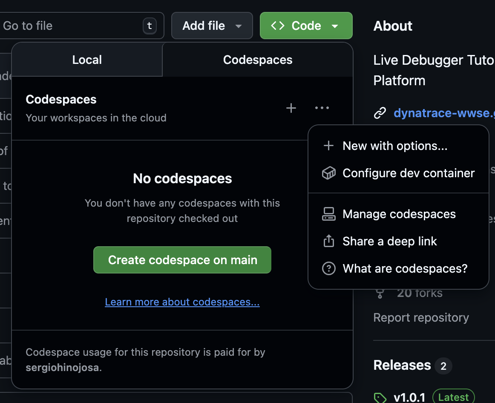
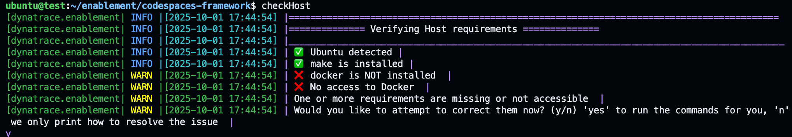
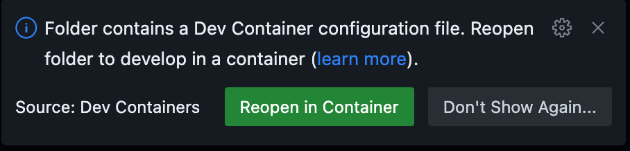

!!! success "Choose the option that best fits your needs! 🚀" 
    The Dynatrace Enablement Framework supports multiple ways to instantiate your development environment. You can run it in Github Codespaces, VS Code Dev Containers or local containers, in AMD or ARM architectures.  


## 🏃🏻‍♂️ Quick Step by Step guide: Instantiating Your Environment

### 1. Running in GitHub Codespaces { align=right ; width="300"}
1. Go to the repository hosted on GitHub.
2. Click the **<> Code** button.
3. Create a new Codespace using the main branch, or click **+ New** to customize how and where to run the Codespace within GitHub Cloud.

_Repository secrets such as `DT_ENVIRONMENT`, `DT_OPERATOR_TOKEN`, and `DT_INGEST_TOKEN` (among others) are injected automatically using GitHub Codespaces secrets. No manual setup is required—these are available as environment variables inside the container._

### 2.  📦 Running in VS Code Dev Containers or Local Container


??? info "Key Difference: VS Code Dev Container vs Local Container"
	The main difference between a VS Code Dev Container and a local container is how each environment is created and managed. A VS Code Dev Container is launched and orchestrated by VS Code using the configuration in `devcontainer.json`. A local container is started independently using the Makefile and `runlocal` script, allowing you to build and manage the container from the terminal without relying on VS Code. This is ideal for headless or automated workflows.


The following steps apply to both scenarios:

1. **Provision the infrastructure**
    
	??? info "🏗️ Setting up the Infrastructure"
		You may provision your infrastructure on any major cloud provider or run locally using [Multipass](#using-multipass-for-local-development).

		**Minimum requirements for a cloud or local machine:**
		
		1. **Operating System:** Ubuntu LTS (22.04 or 24.04 recommended)
		2. **CPU & Memory:** Requirements depend on your workloads. As a guideline, refer to the `hostRequirements` section in `.devcontainer.json`. A typical setup with 4 CPU cores and 16 GB RAM is sufficient for most use cases.
		3. **Network Ports:** Ensure the following ports are open for inbound connections:
			1. `22` (SSH)
			2. `80` — nginx ingress HTTP; all apps exposed via nginx ingress + sslip.io magic DNS (e.g. `http://todoapp.<your-ip>.sslip.io`)
			3. `443` — nginx ingress HTTPS (optional; required for TLS-terminated routes)

2. **SSH into the host**

3. **Clone the repository**

4. **Set up secrets and environment variables**
	- Define all required secrets as environment variables. For both VS Code Dev Containers and local containers, create a `.env` file under `.devcontainer/runlocal/.env`.
	- The secrets required are defined in the `secrets` section of `.devcontainer.json`. If no secrets are needed, create an empty `.env` file.

	??? info "Sample `.env` file"
		You can copy and paste the following sample into `.devcontainer/runlocal/.env`. Ensure all required secrets for the training are included.

		```properties title=".devcontainer/runlocal/.env" linenums="1"
		# Environment variables as defined as secrets in the devcontainer.json file
		# Dynatrace Tenant
		DT_ENVIRONMENT=https://abc123.apps.dynatrace.com

		# Dynatrace Operator Token
		DT_OPERATOR_TOKEN=dt0c01.XXXXXX

		# Dynatrace Ingest Token
		DT_INGEST_TOKEN=dt0c01.YYYYYY

		# Add any other environment variables as needed
		```

5. **Verify prerequisites**
	- Ensure `make` and `docker` are installed on the host and the user has access to Docker.
    
	??? info "Verify prerequisites with `checkHost`"
		Use the provided function to verify requirements. If any are missing, the function offers to install them for you.
		```bash
		source .devcontainer/util/source_framework.sh && checkHost
		```
		{ align=center ; width="800";}

!!! success "Ready to Launch"
	You are all set! Launch the enablement with VS Code as a dev container or with `make` as a plain Docker container.


#### 2. a. 📦 🖥️ Running as dev container with VS Code 

1. Let's tell VS Code to read the secrets as environment variables from an `.env`file. Modify the `runArgs` in `.devcontainer/devcontainer.json` and add `"--env-file", ".devcontainer/runlocal/.env"`like the following:
	```json
	"runArgs": ["--init", "--privileged", "--network=host", "--env-file", ".devcontainer/runlocal/.env"]
	```
- This ensures all variables in `.devcontainer/runlocal/.env` are available inside the container.
- { align=right ; width="400"}Open the folder in VS Code and use the Dev Containers extension to "Reopen in Container". VS Code will use the `.devcontainer/devcontainer.json` definition to build and start the environment for you.
- You can rebuild the container at any time by typing ```[CTRL] + Shift P > Dev Containers: Rebuild and reopen in container```

#### 2. b. 📦 🐳 Running as local container with make
1. Navigate to `.devcontainer` folder and run:
	```sh
	make start
	```
- This will build and launch the container. All ports, volumes, and environment variables are set up automatically.
	
	!!! info "Protip: create a new Terminal"
		For attaching a new Terminal to the container, just type `make start`.

- Secrets and environment variables are loaded from `.devcontainer/runlocal/.env`. 
- The `makefile.sh` script passes the variables to Docker at runtime such as arguments, volume mounts and port-forwarding. The devcontainer.json file is not used with this set-up.


## Instantiation Types 
### 1. ☁️ GitHub Codespaces

- **One-click cloud dev environments**  
- No local setup required—just click  
- [Learn more about Codespaces](https://github.com/features/codespaces)

[](https://github.com/codespaces/new?template_repository=dynatrace-wwse/codespaces-framework)

#### Accessing apps in Codespaces

Port **80** is forwarded automatically from the container. Once `post-create.sh` finishes, open the forwarded port in the Ports panel or use the URL shown in the terminal:

```
https://{codespacename}-80.app.github.dev
```

The nginx ingress has a **catch-all rule** (no Host restriction) that routes all unmatched traffic to the primary app deployed in that Codespace. Multi-app repos register apps in order; the last one registered owns the catch-all. Secondary apps are still reachable via their sslip.io URL (e.g. `http://bugzapper.127.0.0.1.sslip.io`).

!!! info "Why `127.0.0.1` in sslip.io URLs inside Codespaces"
    `detectIP()` returns `127.0.0.1` inside a Codespace. The sslip.io hostname `todoapp.127.0.0.1.sslip.io` resolves to `127.0.0.1` (the container's loopback), so the sslip.io Host-header rule also works inside the Codespace terminal.

### 2. 🖥️ VS Code Dev Containers

- Use the [Dev Containers extension](https://marketplace.visualstudio.com/items?itemName=ms-vscode-remote.remote-containers) for a seamless local experience in VS Code
- All configuration is in `.devcontainer/devcontainer.json`
- Supports secrets, port forwarding, and post-create hooks
- Apps are accessible at `http://<app>.<your-ip>.sslip.io` (port 80 forwarded)


### 3. 🐳 Local Container

- Run the same environment on your machine using Docker.
- Easiest way: just run `make start` in the `.devcontainer` folder.
- This will build and launch the container if needed, or attach to it if already running.
- All ports, volumes, and environment variables are set up for you automatically.
- Apps are accessible at `http://<app>.<your-ip>.sslip.io` — the host's port 80 routes to the nginx ingress inside the container.


### 4. 🛰️ Orbital (Sysbox / Training delivery)

Orbital is the Dynatrace WWSE self-service training platform. Each job runs inside a
[Sysbox](https://github.com/nestybox/sysbox) container (Docker-in-Docker without
`--privileged`) on an EC2 worker. Orbital is the only instantiation type that uses
**wildcard subdomains** instead of port forwarding.

#### How apps are exposed in Orbital

Every app gets a dedicated HTTPS URL derived from the job ID:

```
https://{appname}--{job_slug}.autonomous-enablements.whydevslovedynatrace.com
```

`job_slug` is derived from the job ID with the verbose worker prefix shortened:

- Worker jobs: `worker-x86_64-34ea2d-...` → `34ea2d-...` (6-char hex replaces `worker-{arch}-`)
- Master jobs: `master-...` stays as-is

The result is then lower-cased, non-`[a-z0-9-]` characters stripped, and truncated so the
full DNS label (`{appname}--{slug}`) stays within the 63-character limit.

**Examples:**

```
# AMD worker job
https://astroshop--34ea2d-codespaces-framework-1779883231-abc123.autonomous-enablements.whydevslovedynatrace.com

# Master job
https://astroshop--master-codespaces-framework-1779883231-abc123.autonomous-enablements.whydevslovedynatrace.com
```

#### How routing works

Works with both `k3d` and `kind` cluster engines — the outer proxy layer is
engine-agnostic; only the inner nginx ingress provider differs (`cloud` for k3d,
`kind` for kind).

```
Browser → nginx (wildcard TLS block)
         → FastAPI /proxy-subdomain/{path}
         → _find_job_by_subdomain() [Redis lookup via normalized prefix scan]
         → http://{worker_ip}:{app_proxy_port}/{path}
              Host: {app}.{worker_ip}.sslip.io   ← nginx ingress routes on this
         → nginx ingress → Envoy / service
```

Key points:

- **No HTML/CSS rewriting.** Every app is served at root `/` so Next.js, SPAs, and
  static asset resolvers all work without `basePath` hacks.
- The nginx ingress always uses the sslip.io host internally. The public wildcard URL
  is a separate nginx front-end that sets the `Host` header for the ingress.
- `app_proxy_port` is a fixed host port (32000–32005) published by the Sysbox
  container and stored in Redis on job start.

#### Environment signals

| Variable | Value | Set by |
|---|---|---|
| `ORBITAL_ENVIRONMENT` | `true` | executor.py (injected into all Orbital container jobs) |
| `ORBITAL_JOB_ID` | `<job_id>` | executor.py (daemon/integration-test; used to compute subdomain slug) |
| `INSTANTIATION_TYPE` | `orbital` | `variables.sh` (reads `ORBITAL_ENVIRONMENT`) |

`detectRunEnvironment()` returns `"orbital"` when `ORBITAL_ENVIRONMENT=true`, which
`getAppURL()` and `registerApp()` use to build the wildcard subdomain URL instead of
the sslip.io or Codespaces URL.

### 5. 🧑‍🚀 Codespaces launched from the Enablement App (planned)

The [Enablement App](enablement-app.md) lets a learner launch a training from inside their
Dynatrace tenant. Today that always provisions an **Orbital** Sysbox job. A planned admin toggle lets
the operator switch the launch backend to a **GitHub Codespace running in the learner's own GitHub
account** — the learner picks a machine, GitHub spins it up and bills it, and **Orbital is repurposed
as a relay** that forwards the terminal, logs, and app URL back into the app player.

This is still the **Codespaces** instantiation type at runtime (`INSTANTIATION_TYPE=github-codespaces`)
— the framework, repo, and `post-create.sh` are identical to opening a Codespace by hand. What is new
is *who pressed start* (the app, via the user's GitHub identity) and *who relays the session* (Orbital).

!!! info "How it works (per-user OAuth, not a shared token)"
    The app mints the DT tokens and runs a **GitHub OAuth service** (`codespace` scope). With the
    **user's** token, Orbital sets the user's Codespaces secrets, calls
    `POST /repos/{owner}/{repo}/codespaces` **as the user** (so the Codespace is owned + billed to
    them). The terminal defaults to the Codespace's **built-in web terminal** (`web_url`); an in-app
    PTY relay (`gh cs ssh` → Orbital PTY bridge) and `gh codespace logs` also work **once the
    `ghcr.io/devcontainers/features/sshd:1` feature is added** to the repo (the stock framework image
    ships no sshd — proven 2026-06-18). `ports visibility 80:public` relays the app URL. A shared bot
    PAT cannot do the create — it has no on-behalf-of, even for a public repo — so the design is per-user.
    DT creds must be **user-scope** Codespaces secrets (repo/org secrets break per-tenant isolation).
    Full design: `dynatrace-app-enablements/docs/CODESPACES_DIRECT_LAUNCH_ANALYSIS.md`.

!!! info "DNS & TLS requirements"
    The wildcard subdomain requires:

    - DNS: `*.autonomous-enablements.whydevslovedynatrace.com A 18.134.158.252` (Google Cloud DNS)
    - TLS: a Let's Encrypt wildcard cert for `*.autonomous-enablements.whydevslovedynatrace.com`
      issued via DNS-01 challenge (manual renewal every 90 days)
    - nginx: `server_names_hash_bucket_size 128` in `/etc/nginx/nginx.conf`


## ⚡ Quick Comparison

| Type                  | Runs On              | VS Code Needed | Fast Start | Customizable | Secrets Handling | Port Forwarding | Best For                  |
|-----------------------|:--------------------:|:--------------:|:----------:|:------------:|:---------------:|:---------------:|---------------------------|
| ☁️ Codespaces         | GitHub Cloud         | ❌             | ✅         | ❌           | Auto-injected   | Auto            | Quick onboarding, demos   |
| 🖥️ VS Code DevContainer | Provided Infrastructure | ✅             | ✅         | ✅           | Auto/manual     | Auto            | Full-featured local dev   |
| 🐳 Local Container    | Provided Infrastructure | ❌             | ✅         | ✅           | Manual/`.env`   | Manual/Makefile | Reproducible local dev    |
| 🛰️ Orbital            | EC2 Sysbox Workers   | ❌             | ✅         | ❌           | Auto-injected   | Wildcard subdomain | Training delivery      |


## 🔐 Secrets & Environment

Secrets and environment variables are handled differently depending on the instantiation type:

| Instantiation Type         | How Secrets Are Provided                                                                 | Where to Configure/Set                        | Notes                                                                                 |
|---------------------------|----------------------------------------------------------------------------------------|-----------------------------------------------|---------------------------------------------------------------------------------------|
| ☁️ Codespaces             | Auto-injected as environment variables from GitHub Codespaces secrets                   | GitHub repository > Codespaces secrets         | No manual setup; secrets available at container start                                 |
| 🖥️ VS Code Dev Containers | Passed as environment variables via `runArgs` and `.env` file                          | `.devcontainer/devcontainer.json`, `.devcontainer/runlocal/.env`      | Edit/add `.devcontainer/runlocal/.env` for local secrets; `runArgs` must include `--env-file`                    |
| 🐳 Local Container        | Loaded from `.devcontainer/runlocal/.env` file and passed to Docker at runtime by `makefile.sh`                | `.devcontainer/runlocal/.env`, `makefile.sh`   | Run `make start` in `.devcontainer`; secrets loaded at container start                |
| 🛰️ Orbital                | Written just-in-time per job as `.devcontainer/.env` by the worker (`executor.py`); minted, tenant-scoped, fail-closed for foreign tenants | Orbital ops-server (no learner action)         | See [Orbital](ops-platform.md); CoE creds never leak cross-tenant                     |
| 🧑‍🚀 App-launched Codespace | The learner's **user-scope** GitHub Codespaces secrets (set once, or via per-user OAuth) — repo/org secrets break per-tenant isolation | `https://github.com/settings/codespaces` or app OAuth | See [Enablement App](enablement-app.md); create API takes no env, so secrets are pre-set |


<!--TODO How to show logs of container  -->
<!--TODO Add Troubleshooting guide with docker ps -->

---

## 🏠 Running locally

### Using Multipass for Local Development

[Multipass](https://multipass.run/) is a lightweight VM manager from Canonical that makes it easy to launch and manage Ubuntu virtual machines on macOS, Windows, and Linux. This is especially useful if you want to run the framework in a clean, reproducible Ubuntu environment without dual-booting or using a full desktop VM.

**Why use Multipass?**

- Ensures compatibility with Ubuntu-based dev containers and scripts
- Isolates your development environment from your host OS
- Quick to launch, easy to reset or remove

#### Basic usage

  -  **Install Multipass** ([instructions](https://multipass.run/install)) 
  -  **Launch an Ubuntu VM:**
	```sh
	multipass launch --name enablement --disk 30G --cpus 8 --memory 32G
	multipass shell enablement
	```

!!! tip "Mounting Volumes on Multipass"
    You can mount folders from your host into the VM using `multipass mount` if you want to edit code locally but run containers in the VM. For example in the following example we are creating a VM mounting the folder `enablement` where you have all repositories of the enablement framework you want to use. 
    ```bash
    multipass launch --name enablement --disk 30G --cpus 8 --memory 32G --mount  /Users/sergio.hinojosa/repos/enablement:/home/ubuntu/enablement
    ```

<div class="grid cards" markdown>
- [Let's continue:octicons-arrow-right-24:](dynatrace-integration.md)
</div>