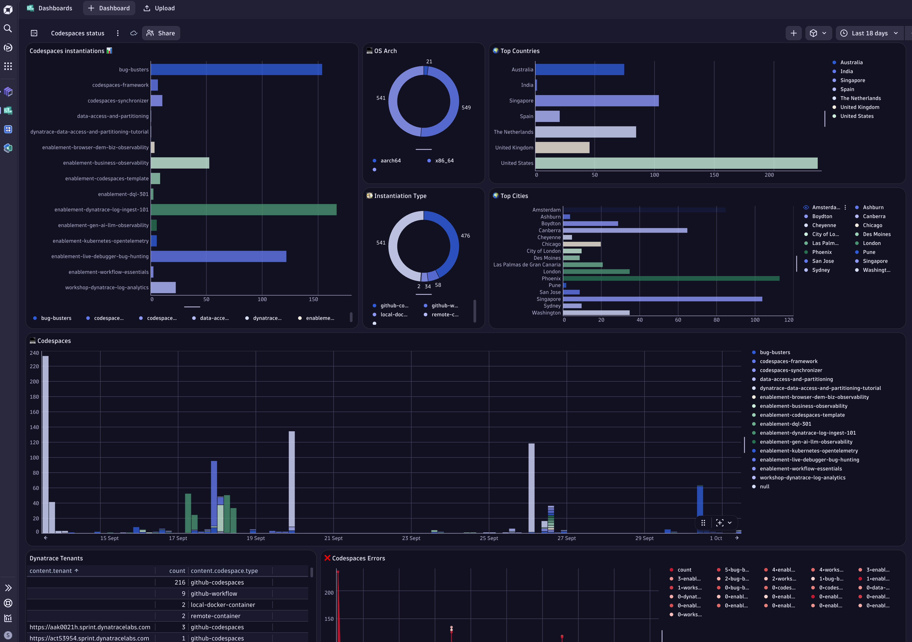

--8<-- "snippets/monitoring.js"

!!! example ""
	Monitoring is a critical aspect of maintaining quality, reliability, and visibility across all repositories and their instantiations in the enablement framework. By tracking usage and interactions, we ensure that every codespace and its associated resources are operating as expected and delivering value.

## 📡 Why Monitoring Matters

- **Visibility:** Gain insights into how repositories and codespaces are being used and adopted.
- **Quality Assurance:** Detect issues early and ensure that all deployments meet expected standards.
- **Business Insights:** Understand usage patterns and derive business value from operational data.
- **Showcase Best Practices:** Demonstrate the power of Dynatrace by monitoring our own codespaces (“Drink your own Champagne” principle).

!!! example ""
	{ align=center ; width="800";} 

## Monitoring Approach

- **GitHub Pages & Agentless RUM:**  
  Every codespace is associated with a GitHub Page. For each GitHub Page, an agentless Real User Monitoring (RUM) application is created, enabling end-to-end visibility into user interactions and performance.

- **Automated Tracking on Creation:**  
  When a new codespace is instantiated, the `finalizePostCreation` function sends a JSON payload to  
  [codespaces-tracker.whydevslovedynatrace.com/api/receive](https://codespaces-tracker.whydevslovedynatrace.com/api/receive).  
  - Only requests with the correct authentication header are accepted.
  - This payload contains metadata about the codespace, its repository, and its usage context.

- **Codespaces-Tracker Service:**  
  The Codespaces-Tracker is a Spring Boot application deployed on a GKE (Google Kubernetes Engine) cluster with three replicas for high availability.
  - It processes incoming payloads, enriches them with geo-information, and logs the json payload.
  - The monitoring OneAgent generates BizEvents from the pods logs, enabling advanced business-related log use cases and analytics.
## Benefits

- **Comprehensive Monitoring:**  
  All codespaces and their GitHub Pages are monitored for activity, performance, and adoption.
- **Enhanced Observability:**  
  Real-time data collection and enrichment provide actionable insights for both technical and business stakeholders.
- **Demonstration of Dynatrace Capabilities:**  
  By monitoring our own codespaces, we showcase Dynatrace’s observability features in real-world scenarios.

---

## Implementation

### 🌎 Codespaces Instantiations

All codespace instantiations are monitored by sending a signal to the Codespaces-Tracker service running in the GKE cluster. This is achieved through the `verifyCodespaceCreation` function, which is responsible for validating the successful creation of a codespace. 

- **verifyCodespaceCreation:**  
  This function checks that the codespace environment has been set up correctly and all required components are running. Once verification is complete, it calls the `postCodespaceTracker` function.
- **postCodespaceTracker:**  
  This function sends a JSON payload containing metadata about the codespace (such as repository name, user, and environment details) to the Codespaces-Tracker API endpoint. The payload is authenticated and enriched with geo-information, and BizEvents are generated from the logs for further analysis.

### 📊 GitHub Pages

GitHub Pages are monitored using Dynatrace Agentless Real User Monitoring (RUM):

- An agentless RUM snippet is injected into the `main.html` template located in the `overrides` folder. This ensures that every page load is tracked for user interactions and performance metrics.
- Additionally, each markdown page includes a JavaScript snippet at the top that sends a BizEvent with the name of the page to Dynatrace. This allows for detailed tracking of user navigation and engagement across the documentation.

---

## Learn More

- [Dynatrace Agentless RUM Documentation](https://www.dynatrace.com/support/help/shortlink/agentless-rum)
- [Business Events with Dynatrace](https://www.dynatrace.com/support/help/shortlink/bizevents)

- [Let's continue:octicons-arrow-right-24:](resources.md)

