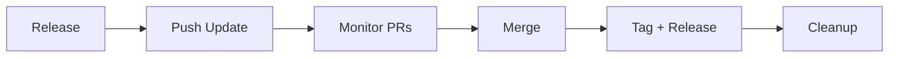

--8<-- "snippets/synchronizer.js"


!!! example "Sync CLI 🔁"
	The **Sync CLI** manages framework versions, migrations, and releases across all repositories in the `dynatrace-wwse` organization. One tool to keep every repo up to date.

## Overview

The Sync CLI runs from the `codespaces-framework` directory and operates on repos listed in `repos.yaml`. It follows a **local-first** workflow: repos are cloned locally, changes are made on branches, then pushed as PRs.

```bash
cd codespaces-framework
PYTHONPATH=. python3 -m sync.cli <command> [options]
```

---

## Workflow

The typical workflow for updating all repos to a new framework version:



### Step 1: Release a new framework version

```bash
# Bump patch (1.2.5 → 1.2.6)
sync release

# Or bump minor/major
sync release --part minor
```

Creates a git tag on `codespaces-framework` and updates the default version in `cli.py`.

### Step 2: Push updates to all repos

```bash
# Preview what would change
sync push-update --framework-version 1.2.6 --dry-run

# Execute: pull main → branch → migrate → commit → push → PR
sync push-update --framework-version 1.2.6
```

Per repo, `push-update`:

1. 📥 Clones if not present locally
2. 🔄 Checks out main and pulls latest
3. 🌿 Creates branch `sync/framework-1.2.6`
4. 🔧 Runs full migration (Category A cleanup, templates, mkdocs, .env, README badges)
5. 📝 Commits all changes
6. 🚀 Pushes branch and creates PR

On failure at any step, the branch is left in place for manual intervention.

### Step 3: Monitor CI and merge

```bash
# List all open PRs with CI status
sync list-pr

# Filter to sync PRs
sync list-pr --framework-version 1.2.6

# Merge passing PRs
sync list-pr --merge
```

### Step 4: Tag and release

After all PRs are merged:

```bash
# Create combined version tags (v1.2.6_1.0.0)
sync tag --framework-version 1.2.6

# Bump repo version and create GitHub Releases
sync tag --framework-version 1.2.6 --bump patch --release
```

### Step 5: Cleanup

```bash
# Delete merged branches (local + remote)
sync cleanup-branches

# Verify everything is clean
sync validate
```

---

## All Commands

### Migration & Updates

| Command | Description |
|---------|-------------|
| `push-update` | Full workflow: pull main → branch → migrate → push → PR. Use `--force` to re-push at same version, `--auto-merge` for auto-merge. |
| `migrate` | Local migration preview/audit. No git operations. Shows what would change. |
| `revert` | Revert uncommitted changes (`git checkout -- . && git clean -fd`). |
| `validate` | Check repos.yaml schema, GitHub accessibility, local clone state (devcontainer.json, templates, README badges). |

### Versioning & Releases

| Command | Description |
|---------|-------------|
| `release` | Bump framework version (patch/minor/major), tag, push. |
| `tag` | Create combined version tags (`v1.2.6_1.0.1`) on consumer repos. Use `--bump` to increment repo version, `--release` to create GitHub Releases. |

### Repository Management

| Command | Description |
|---------|-------------|
| `clone` | Clone all repos from repos.yaml that aren't local. Use `--all` for non-sync-managed repos too. |
| `protect-main` | Apply branch protection (require CI, enforce admins). |
| `cleanup-branches` | Delete merged branches (local + remote). |

### Monitoring

| Command | Description |
|---------|-------------|
| `list-pr` | List open PRs with CI status. Use `--approve` and `--merge` to approve/merge passing PRs. |
| `list-issues` | List open issues across repos. Use `--label` to filter. |
| `status` | Show framework version drift across repos. |
| `list` | List registered repos. Use `--sync-managed`, `--ci-enabled`, `--json`. |

---

## Migration: What Happens

When `push-update` or `migrate` runs on a repo, it executes these phases:

### Phase 1: Audit
Identifies Category A files (framework-owned) that need removal and validates `devcontainer.json` against the framework reference.

### Phase 2: Clean Category A files
Removes framework-owned files (`functions.sh`, `variables.sh`, `Dockerfile`, `apps/`, `yaml/`, etc.) — these are now pulled from the cache at runtime.

### Phase 3: Install thin Makefile
Replaces the repo's `Makefile` with a thin wrapper that bootstraps the cache and delegates to the cached `makefile.sh`.

### Phase 4: Install/update source_framework.sh
Writes the versioned pull mechanism with the correct `FRAMEWORK_VERSION` pin and sparse-checkout configuration.

### Phase 5: Migrate mkdocs.yaml
Converts to `INHERIT: mkdocs-base.yaml` pattern, extracting only repo-specific fields (site_name, nav, RUM snippet).

### Phase 6: Update overrides/main.html
Parameterizes the RUM snippet via `config.extra.rum_snippet` instead of hardcoding it.

### Phase 7: Update deploy-ghpages.yaml
CI workflow now fetches `mkdocs-base.yaml` from the framework at the pinned version.

### Phase 8: Update .gitignore
Adds entries for `.devcontainer/.cache/`, `mkdocs-base.yaml`, and `Dockerfile.framework`.

### Phase 9: Migrate .env location
Moves `.env` from `runlocal/.env` to `.devcontainer/.env`. Updates `.vscode/mcp.json`, `.gitignore`, CI workflows, and docs.

### Phase 10: Validate README badges
Updates badges to current branding (Dynatrace Intelligence, Mastering Complexity). Converts integration tests badge to clickable link. Validates all badges reference the correct repo name.

---

## Examples

### First-time setup

```bash
# Clone all repos
sync clone

# Validate current state
sync validate

# Migrate all repos (dry-run first)
sync migrate --dry-run
```

### Deploying a framework update

```bash
# 1. Make changes to the framework, commit, then release
sync release --part patch

# 2. Push to all repos
sync push-update --framework-version 1.2.6

# 3. Wait for CI, then merge
sync list-pr --merge

# 4. Tag and release
sync tag --framework-version 1.2.6 --bump patch --release

# 5. Cleanup
sync cleanup-branches
```

### Re-pushing changes at the same version (e.g. badge updates)

```bash
sync push-update --framework-version 1.2.6 --force
```

### Housekeeping

```bash
# Protect main branch on all repos
sync protect-main

# Clean up stale branches
sync cleanup-branches --dry-run
sync cleanup-branches

# Check for issues
sync list-issues
```

---

## Key Files

| File | Purpose |
|------|---------|
| `sync/cli.py` | CLI entry point and argument parsing |
| `sync/core/repos.py` | `repos.yaml` parsing, validation, `RepoEntry` dataclass |
| `sync/core/version.py` | Version parsing, bumping, `FRAMEWORK_VERSION` extraction |
| `sync/core/github_api.py` | GitHub API wrapper via `gh` CLI |
| `sync/core/local_git.py` | Local git operations (clone, pull, branch, commit, push) |
| `sync/commands/migrate.py` | Migration logic, Category A/B file lists, all templates |
| `sync/commands/push_update.py` | Local-first push-update workflow |
| `sync/commands/validate.py` | Schema + GitHub + local clone validation |
| `repos.yaml` | Registry of all repos with metadata |

---

<div class="grid cards" markdown>
- [Continue to Testing →](testing.md)
</div>
