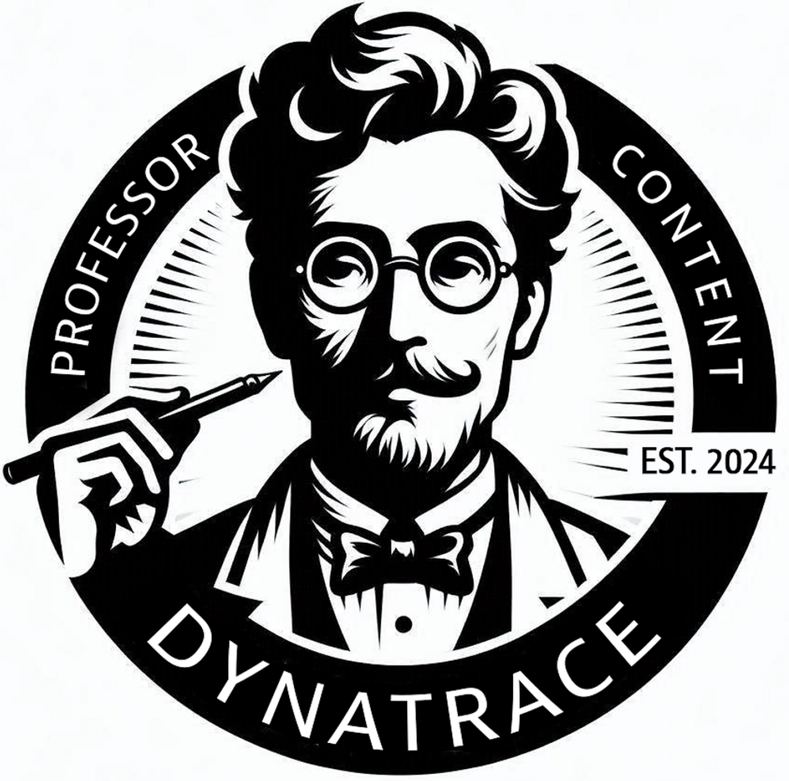

# 4. Codespaces Template

{ align=right ; width="200"}  
The [Enablement Codespaces Template](https://github.com/dynatrace-wwse/enablement-codespaces-template) is a ready-to-use GitHub repository designed to help you create, customize, and deliver hands-on enablements using GitHub Codespaces. It provides a robust starting point for professors, trainers, and solution architects to build interactive learning environments with minimal setup.

---

## 🚀 What is the Codespaces Template?

This template repository provides:

- A pre-configured `.devcontainer` for instant Codespaces launches
- Example documentation and structure for enablement content
- GitHub Actions for CI/CD and documentation deployment
- Integration with Dynatrace and other cloud-native tools
- A clean starting point for your own enablement projects

---

## 📦 Repository Overview

**Main features:**

- **.devcontainer/**: All configuration for Codespaces and local dev containers
- **docs/**: MkDocs-based documentation, ready to extend
- **.github/workflows/**: CI/CD for integration tests and GitHub Pages deployment
- **README.md**: Project overview and quickstart
- **mkdocs.yaml**: Navigation and site configuration

For a full file/folder breakdown, see the [repository on GitHub](https://github.com/dynatrace-wwse/enablement-codespaces-template).

---

## 📝 How to Use the Template

1. **Create your own enablement repository**
	- Click "Use this template" on [the GitHub repo](https://github.com/dynatrace-wwse/enablement-codespaces-template)
	- Name your new repository and clone it locally
2. **Customize the content**
	- Edit the `docs/` folder to add your enablement instructions, labs, and resources
	- Update `.devcontainer/devcontainer.json` to add dependencies or secrets as needed
3. **Launch in Codespaces**
	- Click the **Code** button in your repo and select "Open with Codespaces"
	- Your environment will be ready in seconds, with all tools and docs pre-installed
4. **Publish documentation**
	- The `installMKdocs` function installs MkDocs inside the container and serves the documentation locally on port 8000, making it easy and enjoyable to write and preview your documentation without hassle.
    - Push changes to `main` to trigger GitHub Pages deployment (see Actions tab)
	- Your docs will be live at `https://<your-org>.github.io/<your-repo>/`

---
## 📝 TODOs in the Codebase

Throughout the template repository, you will find `TODO` comments in various files. These are designed to guide you step-by-step as you create your own enablements—reminding you where to add content, configure secrets, or customize scripts.

**Tip:**
To make working with TODOs easier, install a TODO highlighting extension in VS Code, such as [TODO Highlight](https://marketplace.visualstudio.com/items?itemName=wayou.vscode-todo-highlight) or [TODO Tree](https://marketplace.visualstudio.com/items?itemName=Gruntfuggly.todo-tree). These extensions help you quickly find and manage all TODOs in your project.

By following and resolving these TODOs, you can efficiently adapt the template to your specific enablement scenario.

---

## 🧑‍🏫 Who is this for?

- Professors and trainers creating hands-on labs
- Solution architects building demo environments
- Anyone who wants a fast, reproducible Codespaces-based enablement

---

## 📚 Documentation & Resources

- [Template Repository](https://github.com/dynatrace-wwse/enablement-codespaces-template)
- [How to use the codespaces template](https://dynatrace-wwse.github.io/enablement-codespaces-template/)

---

- [Let's continue:octicons-arrow-right-24:](framework.md)

