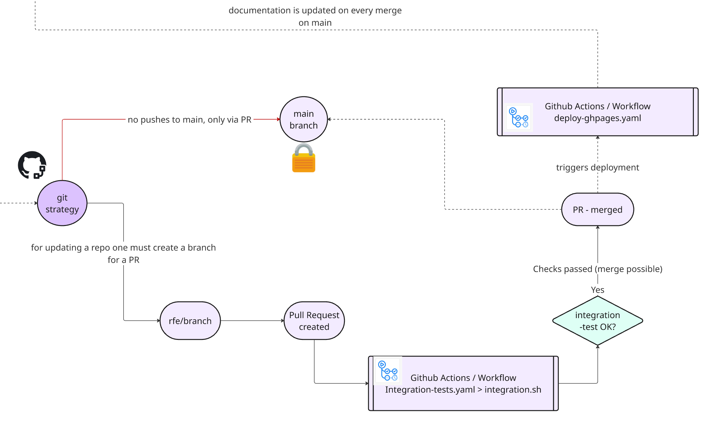

!!! example "Quality Assurance"
    To maintain high standards across all repositories using the enablement framework, a robust testing strategy is enforced. This ensures every repository remains reliable, consistent, and production-ready.

## 🧪 Integration Testing on Pull Requests

- **Automated Integration Tests:**  
  Every repository must include integration tests that run automatically on every Pull Request (PR). This ensures new changes do not break existing functionality.

- **integration.sh Script:**  
  The core of the testing process is the `integration.sh` script, located at `.devcontainer/test/integration.sh` in each repository. This script is adapted per repo and is triggered by a GitHub Actions workflow on every PR.
  - The workflow provisions a full environment (K3d cluster + Dynatrace Operator + demo apps).
  - Once the environment is ready, `integration.sh` runs a series of assertions to verify that pods, services, and applications are running as expected.

- **On-Demand Testing:**  
  Run integration tests locally using the Makefile:
  ```bash
  cd .devcontainer && make integration
  ```

### Example: integration.sh

```bash title=".devcontainer/test/integration.sh" linenums="1"
#!/bin/bash
# Load framework
source .devcontainer/util/source_framework.sh

printInfoSection "Running integration Tests for $RepositoryName"

# Kubernetes cluster health
assertRunningPod kube-system coredns

# Dynatrace Operator components
assertRunningPod dynatrace operator
assertRunningPod dynatrace activegate

# Demo application
assertRunningPod todoapp todoapp

# App is reachable via nginx ingress + magic DNS (sslip.io)
assertRunningApp todoapp

printInfoSection "Integration tests completed for $RepositoryName"
```

---

## 🔬 Test Functions Reference

All test assertion functions are defined in `.devcontainer/test/test_functions.sh` and are automatically loaded into every shell session via `functions.sh`.

### Pod & Container Assertions

| Function | Signature | Description |
|----------|-----------|-------------|
| `assertRunningPod` | `assertRunningPod <namespace> <name>` | Verifies pods matching `name` exist and are running in `namespace`. Exits 1 if none found. |
| `assertRunningContainer` | `assertRunningContainer <name>` | Verifies a Docker container with `name` is running (via `docker ps`). |

```bash
assertRunningPod dynatrace operator        # checks DT operator pods
assertRunningPod kube-system coredns       # checks CoreDNS
assertRunningContainer my-sidecar          # checks docker container
```

### HTTP & Application Assertions

| Function | Signature | Description |
|----------|-----------|-------------|
| `assertRunningApp` | `assertRunningApp <app-name>` | Probes the app via nginx ingress using both magic-DNS (`app.<ip>.sslip.io`) and hostname-based hosts. Retries up to 8× with 3s spacing. |
| `assertRunningHttp` | `assertRunningHttp <port> [path]` | Asserts an HTTP endpoint on localhost returns 200 OK. Retries up to 5× with 3s delay. |

```bash
assertRunningApp todoapp            # ingress-based check (K3d + sslip.io)
assertRunningHttp 8000 /health      # direct port check (MkDocs, etc.)
```

!!! note "assertRunningApp vs assertRunningHttp"
    `assertRunningApp` is the modern check — it validates that nginx ingress routing is working correctly with magic-DNS. Use `assertRunningHttp` only for services exposed directly on a host port (not through ingress).

### Ingress & Deployment Assertions

| Function | Signature | Description |
|----------|-----------|-------------|
| `assertIngressRoute` | `assertIngressRoute <app-name> <namespace>` | Verifies an Ingress resource named `<app-name>-ingress` exists in the namespace and has a host rule. |
| `assertAppDeployed` | `assertAppDeployed <app-name> <namespace> [port]` | Full stack check: pod running + ingress route (or NodePort if USE_LEGACY_PORTS=true). |

```bash
assertIngressRoute todoapp todoapp        # checks Ingress resource
assertAppDeployed astroshop astroshop    # pod + ingress
```

### Environment Variable Assertions

| Function | Signature | Description |
|----------|-----------|-------------|
| `assertEnvVariable` | `assertEnvVariable <var-name> [pattern]` | Asserts an env variable is set and optionally matches a regex pattern. |

```bash
assertEnvVariable DT_ENVIRONMENT
assertEnvVariable DT_ENVIRONMENT "^https://.*\.dynatrace\.com"
assertEnvVariable FRAMEWORK_VERSION "^1\."
```

---

## 🧩 Unit Tests (BATS)

The framework includes a suite of shell unit tests using [BATS (Bash Automated Testing System)](https://bats-core.readthedocs.io/). Unit tests do not require Docker or Kubernetes — they test shell function logic in isolation.

```bash
# Run unit tests on the host
cd .devcontainer && make test

# Run unit tests inside the running container
cd .devcontainer && make test-in-container
```

Unit tests live in `.devcontainer/test/unit/`. The framework ships with 78+ unit tests covering:
- `variablesNeeded` validation logic
- `parseDynatraceEnvironment` URL parsing and export
- Token format validation
- Cluster engine routing
- Port allocation logic

---

## Git Strategy

!!! example "Git Strategy & GitHub Actions Workflow"
    { align=center ; width="800";}

## 🔒 Branch Protection

**Main Branch Protection:**  
  The `main` branch is protected and will only accept PRs that pass all integration tests. This ensures only thoroughly tested code is merged, maintaining the integrity of the repository.

---


## 🛡️ Integration Test Badges

All repositories in the enablement framework display an **integration test badge** to show the current status of their automated tests. This badge provides immediate visibility into the health of each repository.

For example, the badge for this repository is:

{ align=center;  }

You can find a table with all enablement framework repositories and their current integration test status in the [README section of this repository](https://github.com/dynatrace-wwse/codespaces-framework).

---

By following these standards, the enablement framework enforces continuous quality assurance and reliability across all managed repositories.


<div class="grid cards" markdown>
- [Continue to Monitoring →](monitoring.md)
</div>
