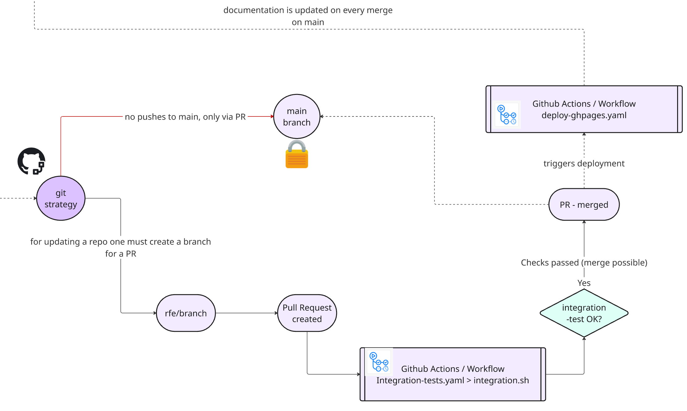

!!! example "Quality Assurance"
    Every repository that uses the enablement framework inherits the same test machinery: shell unit
    tests for the framework functions, Python unit tests for the Sync CLI, and a devcontainer
    integration test that runs on every Pull Request. This page describes what exists, how to run it,
    and — just as important — **what each layer does and does not prove**.

## 🧭 The test layers at a glance

| Layer | Lives in | Runner | What it proves | Runs in CI |
|---|---|---|---|---|
| **Shell unit tests** | `.devcontainer/test/unit/*.bats` | [bats](https://bats-core.readthedocs.io/) | Framework shell logic in isolation — no Docker, no Kubernetes | ✅ `framework-tests.yaml` |
| **Sync CLI unit tests** | `sync/tests/test_*.py` | pytest | The repo-sync CLI: `repos.yaml` parsing, version maths, command behaviour | ❌ not wired to a workflow yet |
| **Repo integration test** | `.devcontainer/test/integration.sh` | GitHub Actions + `devcontainers/ci` | The devcontainer builds, boots, and the repo's own assertions hold | ✅ `integration-tests.yaml` (PR) |
| **Framework integration suites** | `.devcontainer/test/integration_*.sh` | Shell, in a real container | Cluster engines, app exposure, Dynatrace deployment modes end to end | Scheduled by Orbital (see [below](#scheduling-and-nightly-runs)) |

!!! tip "Check that your check could have failed"
    A test that cannot go red is not a test. Before trusting a green run, confirm the runner actually
    collected tests — `bats` reporting *no* tests, or a script that prints a success banner with its
    assertions commented out, both look exactly like success. Every count on this page comes with the
    command that reproduces it, so you can re-derive it instead of trusting it.

---

## 🧩 Shell unit tests (BATS)

Unit tests exercise the framework's shell functions in isolation — no cluster, no Dynatrace tenant,
no Docker daemon required.

```bash
# On the host (bats must be installed)
cd .devcontainer && make test

# Inside the running container (installs bats if the image lacks it)
cd .devcontainer && make test-in-container

# Directly, with TAP output
bats .devcontainer/test/unit/ --tap
```

### What is covered

| File | Area |
|---|---|
| `test_env_management.bats` | `.env` handling, `variablesNeeded`, environment parsing/export |
| `test_dynakube.bats` | Dynakube manifest generation and mode selection |
| `test_ingress.bats` | nginx ingress rules, magic-DNS hosts, app registry |
| `test_cluster_engine.bats` | `CLUSTER_ENGINE` routing between K3d and Kind |
| `test_source_framework.bats` | DEV vs CACHE mode, cache tiers, version pin resolution |
| `test_docker_group_access.bats` | Docker socket GID recovery |
| `test_greeting.bats` | Terminal greeting rendering |
| `test_token_config.bats` | Token format validation and migration status |
| `test_instantiation_type.bats` | `INSTANTIATION_TYPE` detection |
| `test_install_codespace_ssh.bats` | SSH install path guards |
| `test_framework_apps_guard.bats` | Framework-owned app guard |

Counting them is a one-liner — always prefer this to a number written in a document:

```bash
bats .devcontainer/test/unit/ --tap | grep -c '^ok'   # tests that passed
grep -rc '^@test' .devcontainer/test/unit/*.bats      # tests declared, per file
```

### In CI

`.github/workflows/framework-tests.yaml` installs bats on `ubuntu-24.04` and runs the whole
directory with `--tap`. It triggers on push and pull request **only when one of these paths
changes** — plus a nightly cron and manual dispatch:

- `.devcontainer/util/**`
- `.devcontainer/test/unit/**`
- `.github/workflows/framework-tests.yaml`

!!! warning "Path filters are part of the test"
    The workflow carries a scar comment explaining why: the filters once named `functions.sh` and
    `my_functions.sh` — paths that exist nowhere in this repository, since the shell sources live
    under `.devcontainer/util/`. Only the nightly cron ever fired, and a `greeting.sh` regression
    merged green. **If you move a shell source, move the filter with it.**

---

## 🐍 Sync CLI unit tests (pytest)

The [Synchronizer](synchronizer.md) has its own suite covering `repos.yaml` parsing, version
parsing/bumping, the GitHub API wrapper, local git operations, and each subcommand.

```bash
pip install -r requirements-dev.txt      # pytest, pytest-mock, pyyaml
pytest sync/tests                        # rootdir comes from sync/pyproject.toml
pytest sync/tests -q --collect-only | tail -1   # how many tests exist right now
```

The suite needs no network and no GitHub token — the GitHub API layer is mocked.

!!! warning "This suite has no CI job yet"
    Nothing in `.github/workflows/` runs it. Verify for yourself rather than taking this page's word
    for it — and note the positive control, which proves the search itself works:
    ```bash
    grep -rn 'pytest\|sync/tests' .github/workflows/   # expected: no output
    grep -rln 'bats' .github/workflows/                # positive control: hits framework-tests.yaml
    ```
    Until it is wired up, run it locally before opening a PR that touches `sync/` or `repos.yaml`.

---

## 🧪 Integration testing on Pull Requests

Every repository carries `.devcontainer/test/integration.sh`, adapted per repo, run by
`.github/workflows/integration-tests.yaml` on every PR targeting `main`. The workflow:

1. Writes the Dynatrace secrets (`DT_ENVIRONMENT`, `DT_OPERATOR_TOKEN`, `DT_INGEST_TOKEN`) into
   `.devcontainer/.env`
2. Rewrites `runArgs` in `devcontainer.json` so the container receives that env file
3. Builds and boots the devcontainer with `devcontainers/ci` against the enablement image
4. Runs `zsh .devcontainer/test/integration.sh` inside it
5. Fails the job — and blocks the PR — if the script exits non-zero. Timeout: 10 minutes.

Run the same thing locally:

```bash
cd .devcontainer && make integration
```

### Example: `integration.sh`

```bash title=".devcontainer/test/integration.sh" linenums="1"
#!/bin/bash
# Load framework
source .devcontainer/util/source_framework.sh

printInfoSection "Running integration Tests for $RepositoryName"

# Kubernetes cluster health
assertRunningPod kube-system coredns

# Dynatrace Operator components
assertRunningPod dynatrace operator
assertRunningPod dynatrace activegate

# Demo application
assertRunningPod todoapp todoapp

# App is reachable via nginx ingress + magic DNS (sslip.io)
assertRunningApp todoapp

printInfoSection "Integration tests completed for $RepositoryName"
```

!!! warning "A banner is not an assertion"
    An `integration.sh` that sources the framework, prints a heading and exits still proves something
    real — **the devcontainer builds and boots** — and for a training with no running application
    that may be the honest answer. But it can never go red, so say so out loud:

    ```bash
    printWarn "This enablement needs no running application — no runtime assertions."
    ```

    What must never happen is the third state: assertions commented out under a line that prints
    *"Integration test passed"*. That is a green light wired to nothing. If an assertion is disabled,
    delete it or explain in a comment why it cannot run here.

### Branch protection

`main` is protected and requires the integration-test status check
(`codespaces-integration-test-with-dynatrace-deployment`, the job name in `integration-tests.yaml`)
to pass before a PR can merge. The Sync CLI applies the same rule across the fleet:

```bash
sync protect-main --dry-run     # preview
sync protect-main               # apply to every active repo
```

---

## 🔬 Test function reference

Assertions live in `.devcontainer/test/test_functions.sh`, which `functions.sh` sources into every
shell session — so they are available in `integration.sh`, in `my_functions.sh`, and interactively.

### Pod & container assertions

| Function | Signature | Behaviour |
|---|---|---|
| `assertRunningPod` | `assertRunningPod <namespace> <name-fragment>` | Verifies the namespace exists and at least one pod matching `<name-fragment>` is running. Exits 1 otherwise. Called with **one** argument it searches all namespaces. |
| `assertRunningContainer` | `assertRunningContainer <name>` | Verifies a Docker container matching `<name>` is running (`docker ps`). |

```bash
assertRunningPod dynatrace operator        # DT operator pods in the dynatrace namespace
assertRunningPod kube-system coredns       # CoreDNS
assertRunningPod todoapp                   # one arg → all namespaces
assertRunningContainer my-sidecar
```

### HTTP & application assertions

| Function | Signature | Behaviour |
|---|---|---|
| `assertRunningApp` | `assertRunningApp <app-name>` | Probes the app through nginx ingress using both the magic-DNS host (`app.<ip>.sslip.io`) and the hostname-based host, honouring `K3D_LB_HTTP_PORT`. Retries with spacing. |
| `assertRunningHttp` | `assertRunningHttp <port> [path]` | Asserts an HTTP endpoint on localhost returns 200 OK. Retries with delay. |
| `assertAstroshopContent` | `assertAstroshopContent` | Astroshop-specific: root path returns valid HTML, page contains shop keywords, at least one static asset loads. Call **after** `assertRunningApp`. |

```bash
assertRunningApp todoapp            # ingress-based check (K3d/Kind + sslip.io)
assertRunningHttp 8000 /            # direct port check (MkDocs, etc.)
```

!!! note "`assertRunningApp` vs `assertRunningHttp`"
    `assertRunningApp` is the check to use — it validates that ingress routing works with magic DNS,
    which is how learners reach the app in every instantiation type. Use `assertRunningHttp` only for
    services published directly on a host port rather than through the ingress.

### Ingress & deployment assertions

| Function | Signature | Behaviour |
|---|---|---|
| `assertIngressRoute` | `assertIngressRoute <app-name> [namespace]` | Verifies an Ingress named `<app-name>-ingress` exists and reports its host rule. Namespace defaults to the app name. |
| `assertAppDeployed` | `assertAppDeployed <app-name> [namespace]` | Full stack check: `assertRunningPod` + `assertIngressRoute`. |

### Environment assertions

| Function | Signature | Behaviour |
|---|---|---|
| `assertEnvVariable` | `assertEnvVariable <var-name> [pattern]` | Asserts the variable is set and, when given, matches the regex. Exits 1 when unset or non-matching. |

```bash
assertEnvVariable DT_ENVIRONMENT
assertEnvVariable DT_ENVIRONMENT "^https://.*\.dynatrace\.com"
```

!!! danger "Placeholders that cannot fail — do not rely on them"
    Three functions in `test_functions.sh` are **stubs**. They print output but assert nothing and
    can never exit non-zero:

    | Function | What it actually does |
    |---|---|
    | `assertDynatraceOperator` | `kubectl get all -n dynatrace`, then prints `TBD` |
    | `assertDynatraceCloudNative` | `kubectl get all` + `kubectl get dynakube`, then prints `TBD` |
    | `assertDynakube` | empty body |

    Calling them makes a test *look* thorough while proving nothing. Until they are implemented, use
    `assertRunningPod dynatrace operator`, `assertRunningPod dynatrace activegate` and an explicit
    `kubectl get dynakube` check instead.

---

## 🚀 Framework integration suites

Beyond the per-repo test, the framework carries its own end-to-end suites. Each one creates a real
cluster, deploys real components, asserts, and tears the cluster down. They run inside a container —
on the [Orbital](ops-platform.md) ops platform, in a Codespace, or on a local machine.

| Suite script | Validates | Arch | Needs Dynatrace credentials |
|---|---|---|---|
| `integration_engines.sh` | nginx ingress app exposure is identical on **K3d and Kind** | Kind leg is AMD64-only and skipped on Sysbox | No |
| `integration_k3d_apps.sh` | Every demo app deploys on K3d and is reachable via ingress | AMD64 only | No |
| `integration_k3d_aitraveladvisor.sh` | AI Travel Advisor stack (Ollama, Weaviate, app) on K3d | AMD64 only (Ollama has no ARM64 image) | `DT_LLM_TOKEN` — skips gracefully when absent |
| `integration_appmon_k3d_todoapp.sh` | Dynatrace **ApplicationMonitoring** end to end on K3d | AMD64 **and** ARM64, run independently | `DT_ENVIRONMENT`, `DT_OPERATOR_TOKEN`, `DT_INGEST_TOKEN` |
| `integration_cnfs_k3d_todoapp.sh` | Dynatrace **CloudNativeFullStack** on K3d | AMD64 **and** ARM64 | same three |
| `integration_dtwiz_k3d.sh` | The `dtwiz` CLI path: install, `status`, `analyze`, `install kubernetes` | any | `DT_ENVIRONMENT` + **`DT_PLATFORM_TOKEN`** (`dt0s16`), not the classic tokens |
| `integration_kind_astroshop.sh` | Astroshop on Kind: ingress, HTML content, static assets | AMD64 only; skipped on Sysbox | No |

Credentials are never baked in: each suite reads them from `.devcontainer/.env` locally, or from
secrets injected per job by the platform that schedules it.

### Why the arch matters

The Dynatrace code module and CSI driver images differ per CPU architecture. Running `appmon` and
`cnfs` independently on AMD64 and ARM64 is what proves the correct image is pulled and injected on
each — a single-arch run cannot show that.

### Running one locally

```bash
# Requires .devcontainer/.env with the credentials the suite needs
bash .devcontainer/test/integration_appmon_k3d_todoapp.sh
bash .devcontainer/test/integration_cnfs_k3d_todoapp.sh
```

!!! warning "Known limitation — OneAgent DaemonSet on K3d"
    K3d nodes are Docker containers. OneAgent's host init module needs real kernel interfaces
    (`/proc`, `/sys`) that container nodes do not provide, so the DaemonSet sits in
    **CrashLoopBackOff**. This is expected, and the CNFS suite **passes despite it**. On Sysbox there
    is a further restriction on host-level syscalls.

    **Validated:** operator running, ActiveGate running, dynakube carries the
    `cloudNativeFullStack:` spec, todo-app deployed and reachable.
    **Not validated:** OneAgent DaemonSet running state — that needs real VM nodes.

### Scheduling and nightly runs

These suites, and the per-repo `integration.sh` of every repository with `status: active` in
`repos.yaml`, are dispatched on a schedule by **Orbital**, the ops platform. Orbital was split out of
this repository into a private one (see [Orbital — Ops Platform](ops-platform.md)), and its
scheduling, queues, worker lanes and result storage are documented there, not here — that
documentation is not publicly reachable.

What is worth knowing from this side of the boundary:

- A nightly run exercises repositories that have had **no PR**, which is how regressions from
  upstream changes (a new operator release, a new K3d version, a rebuilt base image) surface.
- A suite that requires a credential the scheduling environment deliberately does not hold can never
  go green there. `integration_dtwiz_k3d.sh` needs `DT_PLATFORM_TOKEN`; if the environment has no
  such token, scope the suite out rather than accepting a permanent red — a signal that is red every
  night is not a signal.

---

## Git Strategy

!!! example "Git Strategy & GitHub Actions Workflow"
    { align=center ; width="800";}

---

## 🛡️ Integration test badges

Every repository displays an integration-test badge, so the health of each repo is visible at a
glance. For this repository:

{ align=center;  }

The full table of framework repositories and their current status is in the
[README of this repository](https://github.com/dynatrace-wwse/codespaces-framework).

---

By keeping these layers separate — shell logic without a cluster, CLI logic without GitHub, and
integration tests with the real thing — a failure points at where it came from, and a green run means
something specific.


<div class="grid cards" markdown>
- [Continue to Monitoring →](monitoring.md)
</div>
