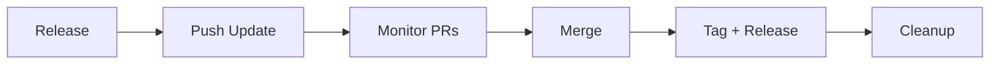

# Sync CLI

Framework version management and repo migration tool for the `dynatrace-wwse` organization.

All commands run from the `codespaces-framework` directory:

```bash
cd codespaces-framework
./sync-cli <command> [options]
```

**Tip:** add an alias and enable tab completion by adding to your `~/.bashrc`:
```bash
alias sync-cli="/home/ubuntu/enablement-framework/codespaces-framework/sync-cli"
eval "$(register-python-argcomplete sync-cli)"  # requires: pip install argcomplete
```

Examples below use `sync-cli` for brevity.

## Workflow: Full release cycle



### 1. Release a new framework version

```bash
# Create GitHub Release for the current tag (no bump)
sync release

# Bump patch (1.2.5 → 1.2.6), tag, push, create GitHub Release
sync release --part patch

# Preview
sync release --part patch --dry-run
```

### 2. Push updates to all repos

```bash
# Preview (uses latest git tag if --framework-version omitted)
sync-cli push-update --dry-run

# Execute: pull main → branch → full migrate → commit → push → PR
sync-cli push-update

# Pin to a specific version
sync-cli push-update --framework-version 1.2.6

# Re-push changes at the same version (e.g. badge updates, template fixes)
sync-cli push-update --force

# Target a specific repo
sync-cli push-update --repo enablement-codespaces-template
```

### 3. Monitor PRs and merge

```bash
# List all open PRs with CI status
sync list-pr

# Filter to sync PRs for a specific version
sync list-pr --framework-version 1.2.6

# Merge passing PRs
sync list-pr --merge

# Close old PRs (e.g. superseded by a new version)
sync list-pr --framework-version 1.2.5 --close -c "Superseded by 1.2.6"

# Approve + merge (approve skips own PRs, merge still works)
sync list-pr --approve --merge
```

### 4. Tag and release consumer repos

```bash
# Create combined version tags (v1.2.6_1.0.0)
sync tag --framework-version 1.2.6

# Bump repo version and create GitHub Releases
sync tag --framework-version 1.2.6 --bump patch --release

# Preview
sync tag --framework-version 1.2.6 --bump patch --release --dry-run
```

### 5. Cleanup

```bash
# Delete merged branches (local + remote)
sync cleanup-branches

# Preview first
sync cleanup-branches --dry-run
```

---

## Local development workflow

### Validate current state

```bash
# Full validation: schema + GitHub + devcontainer.json + templates + README badges
sync validate

# Validate a specific repo
sync validate --repo enablement-codespaces-template
```

### Migrate repos locally (preview/audit)

```bash
# Preview what migration would do
sync migrate --dry-run

# Run migration on all sync-managed repos (no git operations)
sync migrate

# Migrate a specific repo
sync migrate --repo enablement-codespaces-template
```

### Review changes

```bash
for repo in enablement-dynatrace-log-ingest-101 remote-environment enablement-codespaces-template; do
  echo "── $repo ──"
  git -C ../$repo diff --stat
  echo
done
```

### Revert if needed

```bash
# Revert all repos
sync revert

# Revert a specific repo
sync revert --repo enablement-codespaces-template
```

### Test locally

```bash
cd ../enablement-codespaces-template/.devcontainer

# Create .env with your secrets (or empty file)
touch .env

# Start container
make start

# Full clean restart (kill containers, clear cache, fresh start)
make clean-start
```

---

## Repository management

### Clone repos

```bash
# Clone all sync-managed repos
sync clone

# Include non-sync-managed repos (website, tracker, framework)
sync clone --all

# Clone a specific repo
sync clone --repo demo-opentelemetry
```

### Protect main branch

```bash
# Preview
sync protect-main --dry-run

# Apply branch protection (require CI, enforce admins)
sync protect-main

# Specific repo
sync protect-main --repo remote-environment
```

### Check issues

```bash
# List all open issues
sync list-issues

# Filter by label
sync list-issues --label bug

# Specific repo
sync list-issues --repo enablement-codespaces-template
```

### Check version drift

```bash
# Show which repos are behind
sync status
```

---

## `migrate` vs `push-update`

| | `migrate` | `push-update` |
|---|---|---|
| Purpose | Local preview/audit | Full end-to-end workflow |
| Git operations | None (works on working tree) | Pull main, branch, commit, push, create PR |
| When to use | Testing migration locally | Deploying a new framework version |

---

## All commands

### Migration & Updates

| # | Command | Description |
|---|---------|-------------|
| 1 | `push-update` | Pull main → branch → migrate → push → PR. `--force` to re-push, `--auto-merge` for auto-merge. |
| 2 | `migrate` | Local migration audit. No git operations. |
| 3 | `revert` | Revert uncommitted changes in repos. |
| 4 | `validate` | Check schema, GitHub, devcontainer.json, templates, README badges. |

### Versioning & Releases

| # | Command | Description |
|---|---------|-------------|
| 5 | `release` | Create GitHub Release for current tag, or `--part patch/minor/major` to bump first. |
| 6 | `tag` | Create combined tags (`v1.2.6_1.0.1`) on consumer repos. `--bump`, `--release`. |

### Repository Management

| # | Command | Description |
|---|---------|-------------|
| 7 | `clone` | Clone repos from repos.yaml. `--all` for non-sync-managed too. |
| 8 | `checkout` | Checkout main and show status. `--pull` to also pull latest. |
| 9 | `protect-main` | Apply branch protection (CI required, enforce admins). |
| 10 | `cleanup-branches` | Delete merged branches (local + remote). |

### Monitoring

| # | Command | Description |
|---|---------|-------------|
| 11 | `list-pr` | List open PRs with CI status. `--approve`, `--merge`, `--close -c "reason"`. |
| 12 | `list-issues` | List open issues. `--label` filter. |
| 13 | `status` | Show framework version drift. |
| 14 | `ci-status` | Show latest CI run status across repos. |
| 15 | `list` | List repos from repos.yaml. `--sync-managed`, `--json`. |

### Other

| # | Command | Description |
|---|---------|-------------|
| 16 | `bump-repo-version` | Bump a repo's version component. |
| 17 | `migrate-mkdocs` | Standalone mkdocs migration (also runs inside `migrate`). |
| 18 | `generate-registry` | Generate HTML registry page from repos.yaml. |
| 19 | `generate-json` | Generate `repos.json` for the org GitHub Pages registry. |

---

## Key files

| File | Purpose |
|------|---------|
| `sync/cli.py` | CLI entry point and argument parsing |
| `sync/core/repos.py` | `repos.yaml` parsing, validation, `RepoEntry` dataclass |
| `sync/core/version.py` | Version parsing, bumping, `FRAMEWORK_VERSION` extraction |
| `sync/core/github_api.py` | GitHub API wrapper via `gh` CLI |
| `sync/core/local_git.py` | Local git operations (clone, pull, branch, commit, push) |
| `sync/commands/migrate.py` | Migration logic, file classification, all templates |
| `sync/commands/push_update.py` | Local-first push-update workflow |
| `sync/commands/validate.py` | Schema + GitHub + local clone validation |
| `sync/commands/release.py` | Framework release with categorized changelog |
| `sync/commands/tag.py` | Consumer repo tagging with GitHub Releases |
| `sync/commands/list_pr.py` | PR listing, approve, merge, close |
| `sync/commands/list_issues.py` | Issue listing across repos |
| `sync/commands/protect_main.py` | Branch protection rules |
| `sync/commands/cleanup_branches.py` | Merged branch cleanup |
| `sync/commands/clone.py` | Repo cloning |
| `sync/commands/revert.py` | Revert uncommitted changes |
| `repos.yaml` | Registry of all repos with metadata |

## Image tiers

Defined per repo in `repos.yaml` via `image_tier` (default: `k8s`):

| Tier | Description |
|------|-------------|
| `minimal` | Core framework only |
| `k8s` | Core + Kind cluster, entrypoint, Dynakube yaml templates |
| `ai` | Same as k8s (extensible for future AI-specific files) |

## What stays in each repo after migration

```
.devcontainer/
  devcontainer.json      # Container config (image, runArgs, secrets)
  .env                   # Secrets for local runs and MCP (gitignored)
  post-create.sh         # Repo-specific setup (custom per repo)
  post-start.sh          # Repo-specific post-start (custom per repo)
  Makefile               # Thin wrapper — delegates to cached makefile.sh
  .cache/                # Framework cache (gitignored, auto-populated)
  util/
    source_framework.sh  # Versioned pull mechanism (FRAMEWORK_VERSION pin)
    my_functions.sh      # Repo-specific custom functions
  test/
    integration.sh       # Repo-specific integration tests
  manifests/             # Repo-specific k8s manifests (if any)
  dynatrace/             # Repo-specific Dynatrace config (if any)
```

Everything else comes from the framework cache at the pinned `FRAMEWORK_VERSION`.
